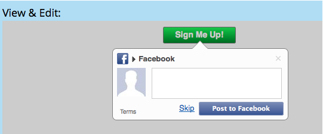

# Definir Requisito de Compartilhamento Social {#set-social-share-requirement}

Ao [criar uma oferta de referência](/help/marketo/product-docs/demand-generation/social/referral-offers/create-a-referral-offer.md), você pode exigir que as pessoas compartilhem a oferta para se inscrever ou torná-la opcional.

>[!IMPORTANT]
>
>Em 31 de julho de 2024, iniciamos o processo de desativação desse recurso. Não é mais possível criar novos ativos. Os ativos existentes continuarão a funcionar até 31 de janeiro de 2025. [Saiba mais](https://nation.marketo.com/t5/employee-blogs/marketo-engage-social-features-deprecation/ba-p/351977){target="_blank"}

1. Vá para **Atividades de marketing**.

   

1. Selecione a oferta de referência e clique em **Editar rascunho**.

   

1. No editor de oferta de referência, vá para **Configurações do Aplicativo** e depois para **Etapas de Fluxo de Inscrição**.

   

1. Selecione a ordem do fluxo de inscrição.

   

   * **Captura de pessoa** > **Compartilhamento**: a pessoa pode ignorar o compartilhamento e se inscrever.
   * **Compartilhar** > **Captura de Pessoa**: a pessoa deve compartilhar para se inscrever.

1. Para cada opção, consulte a visualização na janela **Exibir e editar**.

   
