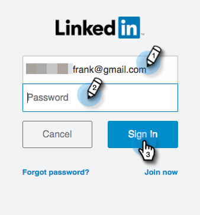

# Configurar formulário de geração de lead do LinkedIn {#set-up-linkedin-lead-gen-forms}

Use o Forms de geração de leads do LinkedIn para executar campanhas de publicidade no LinkedIn e gerar leads para o Marketo.

>[!IMPORTANT]
>
>O LinkedIn está atualizando as APIs de marketing usadas pelas integrações do Marketo Engage LinkedIn. Essas alterações exigirão reautenticação de todos os serviços do LinkedIn LaunchPoint no menu **Admin** > **LaunchPoint** entre 7 de junho e 15 de dezembro de 2024 para evitar a interrupção do serviço. Para obter mais informações, consulte as [Perguntas frequentes sobre migração](https://nation.marketo.com/t5/employee-blogs/linkedin-re-authentication-required/ba-p/347794){target="_blank"}.

>[!NOTE]
>
>**Permissões de administrador necessárias**

>[!NOTE]
>
>Um cliente potencial do LinkedIn não entrará no Marketo Engage se ele corresponder a um registro de pessoa existente no Marketo associado a um registro de empresa criado usando APIs de empresa, e se a assinatura do Marketo não estiver conectada a um CRM.

1. Vá para a área **[!UICONTROL Administrador]**.

   

1. Vá para **[!UICONTROL LaunchPoint]**, clique em **[!UICONTROL Novo]** e selecione **[!UICONTROL Novo Serviço]**.

   

1. Insira um _Nome para Exibição_ para seu serviço, selecione o serviço **[!UICONTROL Líder do LinkedIn]** no menu suspenso e clique em **[!UICONTROL Avançar]**.

   

1. O Marketo abre uma nova guia no mesmo navegador em [linkedin.com](https://www.linkedin.com){target="_blank"}. Faça logon no LinkedIn usando a conta que deseja usar para a integração.

   >[!NOTE]
   >
   >A conta do LinkedIn precisa acessar todas as contas de negócios do LinkedIn para as quais você está criando campanhas patrocinadas.

   

1. Depois de entrar no LinkedIn, volte para o Marketo e clique em **[!UICONTROL Autorizar]**.

   

1. Quando solicitado, clique em **[!UICONTROL Permitir]** para aceitar a instalação do aplicativo Marketo no LinkedIn.

   

1. Você perceberá que está autorizado. Clique em **[!UICONTROL Avançar]**.

   

   >[!CAUTION]
   >
   >O serviço expira automaticamente um ano após a autorização. Para recuperar o acesso, basta clicar em **[!UICONTROL Reautorizar]**. Talvez seja necessário digitar novamente sua senha do LinkedIn, dependendo das configurações do navegador.

1. Selecione as contas das quais você deseja que os clientes em potencial do LinkedIn entrem no Marketo e clique em **[!UICONTROL Avançar]**.

   >[!TIP]
   >
   >Se você não vir as contas comerciais que está esperando, verifique se a conta do LinkedIn do usuário que está sendo autorizada tem permissões de gerente de formulário de geração de lead para a conta comercial no LinkedIn.

   

1. Para aceitar os mapeamentos de campo padrão do LinkedIn para o Marketo, basta clicar em **[!UICONTROL Criar]**. Se você quiser alterar o mapeamento de campo padrão, remover um mapeamento de campo ou adicionar um novo mapeamento de campo, poderá fazer isso por campo por meio do modal abaixo.

   >[!CAUTION]
   >
   >O Marketo oferece suporte ao mapeamento de dois campos do LinkedIn para um único campo do Marketo, _mas somente quando_ os dois campos do LinkedIn não estão no mesmo formulário. Se você mapear dois campos do mesmo formulário do LinkedIn para um único campo do Marketo, as pessoas podem falhar ao inserir o banco de dados do Marketo.

   

   >[!NOTE]
   >
   >Somente os campos do LinkedIn que já foram salvos em um [modelo de formulário](https://www.linkedin.com/help/lms/answer/79634){target="_blank"} no Gerenciador de campanhas do LinkedIn serão exibidos como Campos do LinkedIn que podem ser mapeados para campos do Marketo.

   

Muito bem! As pessoas que enviam formulários do líder do LinkedIn começarão a fluir para o Marketo à medida que você executa campanhas bem-sucedidas no lado do LinkedIn.

>[!NOTE]
>
>Você só pode autorizar uma única conta de usuário do LinkedIn. Se você tiver várias contas comerciais que gostaria de vincular ao Marketo, verifique se a conta do LinkedIn do usuário que está sendo autorizada tem permissões de gerente de formulário de geração de lead para a conta comercial no LinkedIn.

>[!MORELIKETHIS]
>
>[Usar acionadores e filtros de formulário da geração de clientes potenciais do LinkedIn em uma campanha inteligente](/help/marketo/product-docs/demand-generation/social/social-functions/use-linkedin-lead-gen-form-filters-and-triggers-in-a-smart-campaign.md){target="_blank"}
