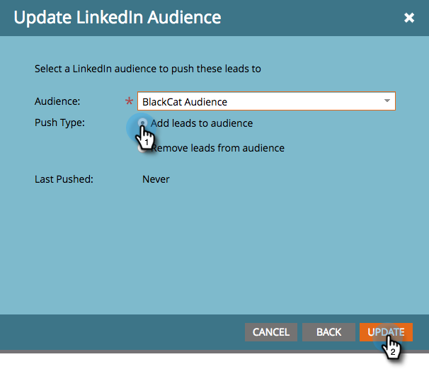

# Usar uma lista do Marketo ou uma lista inteligente como um segmento de público-alvo do LinkedIn {#use-a-marketo-list-or-smart-list-as-a-linkedin-audience-segment}

Integre sua equipe do Marketo Engage aos públicos do LinkedIn.

>[!PREREQUISITES]
>
>[Adicionar públicos correspondentes do LinkedIn como um serviço do LaunchPoint](/help/marketo/product-docs/demand-generation/ad-network-integrations/add-linkedin-matched-audiences-as-a-launchpoint-service.md){target="_blank"}

1. Vá para o **Banco de Dados**.

   

1. Selecione uma lista inteligente.

   

1. Clique na guia **Pessoas**.

   

1. Clique no ícone  **Enviar por meio do Ad Bridge** na parte inferior da lista.

   

   >[!NOTE]
   >
   >Ao usar integrações de rede de anúncios para enviar um público-alvo para o LinkedIn, o Marketo envia somente o endereço de email.

1. Selecione **LinkedIn** e clique em **Avançar**.

   

1. Selecione um **Público-alvo do LinkedIn**.

   >[!NOTE]
   >
   >Clicar em **+Novo público-alvo** criará um público-alvo no LinkedIn Campaign Manager.

   

   >[!NOTE]
   >
   >O LinkedIn substituiu as APIs usadas para o tipo de push &quot;Limpar público-alvo e adicionar clientes potenciais&quot; em março de 2018. Essa opção não está mais disponível na versão do primeiro trimestre de 2018 da Marketo.

1. Selecione um **Tipo de push**. Clique **Atualizar**.

   

   >[!NOTE]
   >
   >Aguarde 15 minutos para que a sincronização ocorra.

Toque cinco! Seus dados agora serão adicionados aos públicos do LinkedIn. Para obter informações sobre como carregar listas para o LinkedIn para direcionamento de contas e contatos, visite o [centro de ajuda de soluções de marketing do LinkedIn](https://www.linkedin.com/help/lms/answer/73938?query=ad%20segment){target="_blank"}.
