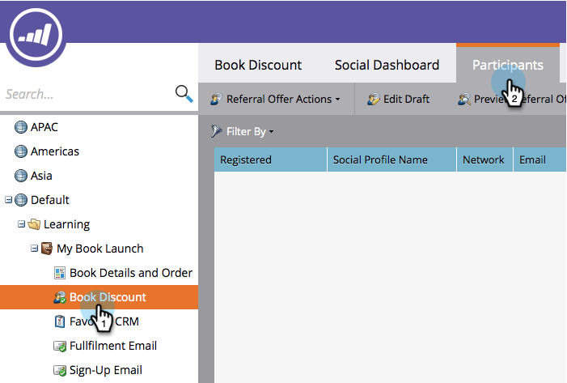

# Usar códigos promocionais para preenchimento de ofertas {#use-promo-codes-for-offer-fulfillment}

Ao criar uma oferta de indicação ou um sorteio, você pode enviar um código promocional (cupom) para cada vencedor. Para resgatar a recompensa, eles usam o código, por exemplo, na página de check-out de uma compra no seu site.

>[!IMPORTANT]
>
>Em 31 de julho de 2024, iniciamos o processo de desativação desse recurso. Você não poderá criar novos ativos. Os ativos existentes continuarão a funcionar até 31 de janeiro de 2025. [Saiba mais](https://nation.marketo.com/t5/employee-blogs/marketo-engage-social-features-deprecation/ba-p/351977){target="_blank"}

## Fazer upload de códigos promocionais {#upload-promo-codes}

1. Vá para **Atividades de marketing**.

   

1. Selecione a oferta de referência e clique em **Editar rascunho**.

   

1. No editor de oferta de referência, vá para **Configurações do Aplicativo** e depois para **Detalhes da Oferta**.

   

1. Em Emails, selecione **Usar Códigos Promocionais** e em Carregar Códigos, clique em **Procurar** para selecionar o arquivo de códigos promocionais do sistema.

   

1. O arquivo de códigos promocionais deve ser um arquivo de texto ASCII simples com um código por linha e uma extensão de nome de arquivo .txt. Por exemplo:

   

   >[!CAUTION]
   >
   >Qualquer espaço em branco no arquivo de códigos promocionais é tratado como parte do código nessa linha. Tenha cuidado especial para evitar espaços no final de cada linha.

1. Quando o upload é concluído, o número total de códigos carregados é exibido.

   

## Revisar códigos promocionais enviados {#review-sent-promo-codes}

Depois que os participantes começarem a receber sua recompensa de oferta, você poderá ver quais códigos promocionais foram enviados para quem e quando.

>[!NOTE]
>
>Somente usuários do Marketo com _permissão para acessar prêmios_ têm acesso a essas informações. Consulte [Gerenciando Funções e Permissões de Usuário](/help/marketo/product-docs/administration/users-and-roles/managing-user-roles-and-permissions.md).

1. Vá para **Atividades de marketing**.

   

1. Selecione sua oferta de indicação ou sorteio e clique na guia **Participantes**.

   

1. Aqui você deve ver algumas entradas. Clique no número na coluna **Códigos promocionais** para ver os códigos promocionais enviados para esse participante e quando.

   
