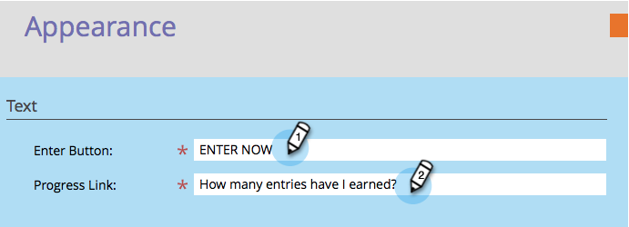

# Personalizar estilos de sorteios {#customize-sweepstakes-styles}

Ao [criar um sorteio](/help/marketo/product-docs/demand-generation/social/sweepstakes/create-sweepstakes.md), você pode personalizar sua aparência na página de aterrissagem.

>[!IMPORTANT]
>
>Em 31 de julho de 2024, iniciamos o processo de desativação desse recurso. Você não poderá criar novos ativos. Os ativos existentes continuarão a funcionar até 31 de janeiro de 2025. [Saiba mais](https://nation.marketo.com/t5/employee-blogs/marketo-engage-social-features-deprecation/ba-p/351977){target="_blank"}

>[!AVAILABILITY]
>
>Nem todos os usuários do Marketo Engage compraram essa funcionalidade. Entre em contato com a equipe de conta do Adobe (seu gerente de conta) para obter mais detalhes.

1. Vá para **Atividades de marketing**.

1. Selecione o sorteio e clique em **Editar Rascunho**.

   

1. No editor de Sorteios, vá para **Configurações do Aplicativo** > **Aparência**.

   

1. Edite o texto do botão de inscrição e o link de progresso.

   

1. Para cada elemento que deseja personalizar, insira suas propriedades de CSS personalizadas.

   

   Exemplo de CSS para o **Botão Enter**:
   `<pre>border: 5px solid #7B68EE; background-color: purple; padding: 10px; font: 16px; color: #FFFFFF; text-align: center;</pre>`

   Exemplo de imagem para o **Botão Enter**:
   `<pre>background:url(https://app.marketo.com/images/public-site/button_sign-up-now.png) no-repeat center center; width:275px; height:95px; margin:auto; display:block;</pre>` `<pre>`

   >[!NOTE]
   >
   >Se você usar uma imagem com texto, lembre-se de remover o texto do campo **Botão Enter** em Texto acima.

1. À medida que você faz cada alteração, o resultado é exibido na pré-visualização Exibir e editar.

   

   >[!NOTE]
   >
   >Teste seu botão em vários navegadores diferentes, incluindo versões mais antigas.

   >[!MORELIKETHIS]
   >
   >A próxima etapa é adicionar [emails de inscrição e preenchimento ao sorteio](/help/marketo/product-docs/demand-generation/social/social-functions/use-emails-in-social-promotions.md).
