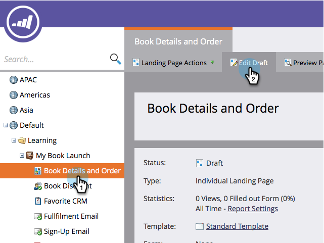
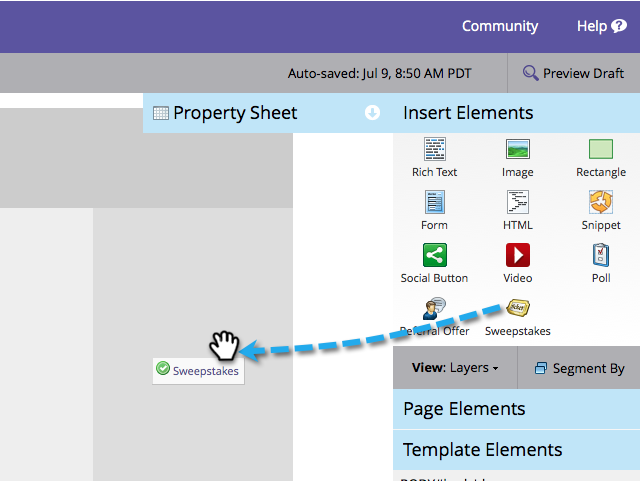

# Sweepstakes do Publish a {#publish-a-sweepstakes}

Depois de [criar um sorteio](/help/marketo/product-docs/demand-generation/social/sweepstakes/create-sweepstakes.md), você poderá publicá-lo nas páginas de aterrissagem do Marketo, em seu site e em seu Facebook.

>[!IMPORTANT]
>
>Em 31 de julho de 2024, iniciamos o processo de desativação desse recurso. Não é mais possível criar novos ativos. Os ativos existentes continuarão a funcionar até 31 de janeiro de 2025. [Saiba mais](https://nation.marketo.com/t5/employee-blogs/marketo-engage-social-features-deprecation/ba-p/351977){target="_blank"}

>[!AVAILABILITY]
>
>Nem todos os usuários do Marketo Engage compraram essa funcionalidade. Entre em contato com a equipe de conta do Adobe (seu gerente de conta) para obter mais detalhes.

>[!NOTE]
>
>Antes de publicar sua oferta, confirme se ela está em conformidade com todas as leis, regras e regulamentos aplicáveis.

1. Localize sua página de aterrissagem e clique em **Editar rascunho**.

   

1. Localize a seção Inserir elementos no lado direito da página. Arraste mais de **Sweepstakes**.

   

1. Selecione o sorteio e clique em **Inserir**.

   

   >[!NOTE]
   >
   >Você precisa aprovar seu sorteio para disponibilizá-lo aqui.

   Parabéns! Aprove a landing page e seu sorteio está online. Você também pode [publicar a página de aterrissagem no Facebook](/help/marketo/product-docs/demand-generation/facebook/publish-landing-pages-to-facebook.md) ou [colocar os sorteios em seu site](/help/marketo/product-docs/demand-generation/social/social-functions/deploy-social-on-your-website.md).

   >[!TIP]
   >
   >Teste e refine seus sorteios. Acesse o sorteio em sua página da Web e inscreva-se com informações de teste. Anote tudo o que você deseja alterar sobre a experiência do usuário.

   >[!NOTE]
   >
   >Quando as pessoas começarem a se inscrever, lembre-se de retornar ao aplicativo para [selecionar os vencedores do sorteio](/help/marketo/product-docs/demand-generation/social/sweepstakes/select-sweepstakes-winners.md)!
