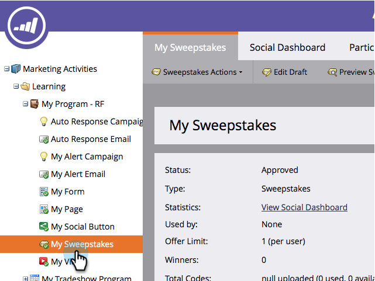

# Selecionar vencedores do sorteio {#select-sweepstakes-winners}

Quando você [publica um sorteio](/help/marketo/product-docs/demand-generation/social/sweepstakes/publish-a-sweepstakes.md), é necessário selecionar vencedores para cada desenho. Ao fazer isso, seu [email de preenchimento](/help/marketo/product-docs/demand-generation/social/social-functions/use-emails-in-social-promotions.md) será enviado automaticamente para eles.

>[!AVAILABILITY]
>
>Nem todos os usuários do Marketo Engage compraram essa funcionalidade. Entre em contato com a equipe de conta do Adobe (seu gerente de conta) para obter mais detalhes.

1. Vá para **Atividades de marketing**.

   

1. Selecione o sorteio.

   

1. Clique em **Escolher Vencedores**.

   

   >[!TIP]
   >
   >Para ver uma lista de pessoas que se inscreveram no sorteio, clique na guia **Participantes**.

1. Escolha o número de vencedores, selecione **Estou pronto para escolher** e clique em **Avançar**.

   

   >[!NOTE]
   >
   >Se você escolher 0 vencedores para um determinado desenho, essas informações não serão exibidas na guia **Vencedores**.

1. Clique em **Finalizar** para enviar o [email de preenchimento](/help/marketo/product-docs/demand-generation/social/referral-offers/send-referral-offer-fulfillment-email.md) aos vencedores listados.

   

   >[!NOTE]
   >
   >Você pode desqualificar vencedores antes de clicar em Finalizar. Se você fizer isso, eles ainda serão elegíveis para outros desenhos neste sorteio.

Parabéns! Você concluiu esta execução da oferta do sorteio, escolheu os vencedores aleatórios e enviou a eles notificações por email.
