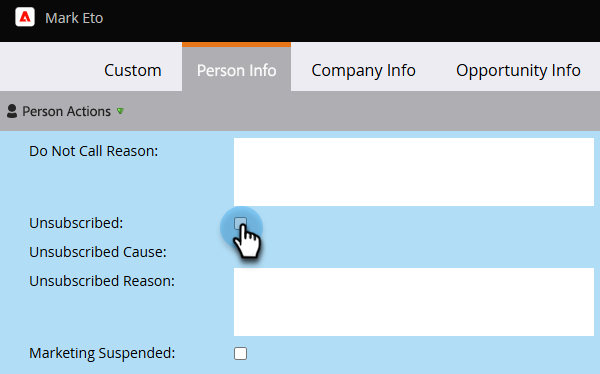

# Cancelamento de assinatura durável {#durable-unsubscribe}

A Marketo aprimorou o comportamento da funcionalidade de cancelamento de inscrição para torná-la &quot;durável&quot;. Um status de email principal foi adicionado, que é separado do sinalizador de cancelamento de inscrição visível no registro de detalhes da pessoa.

Se o sinalizador de cancelamento de inscrição estiver definido como falso para verdadeiro, o status do email principal será atualizado e a alteração será propagada para outras pessoas com o mesmo endereço de email. Se uma pessoa for removida e recriada, ou se um novo registro for criado com o mesmo endereço de email, o sinalizador de cancelamento de inscrição **não** será substituído.

>[!NOTE]
>
>O cancelamento de inscrição durável funciona em todas as partições em todo o banco de dados do Marketo.

## Atualizar o sinalizador de cancelamento de inscrição de Verdadeiro para Falso (por exemplo, Assinar novamente uma pessoa) {#update-the-unsubscribe-flag-from-true-to-false-e-g-re-subscribe-a-person}

Há várias maneiras de uma pessoa ser inscrita novamente.

No Salesforce, desmarque o campo Recusa de email no registro do lead/contato. Isso será sincronizado com o Marketo.

No Marketo, desmarque a caixa de cancelamento de inscrição na guia Informações do registro da pessoa.

Execute uma etapa de fluxo **[!UICONTROL Alterar Valor de Dados]** como mostrado abaixo em uma ou várias pessoas.

## Criar uma nova pessoa {#creating-a-new-person}

Quando uma nova pessoa é criada, o Marketo a verifica em relação à tabela principal de status de email. Se a inscrição da pessoa foi cancelada anteriormente, o registro será atualizado para cancelado.

## Alteração de um endereço de email {#changing-an-email-address}

Se você alterar o endereço de email de uma pessoa para um endereço de email cuja assinatura foi cancelada, essa pessoa terá a assinatura cancelada. Esta alteração pode ocorrer no Marketo ou [!DNL Salesforce].

## Assinando novamente {#re-subscribing}

Da mesma forma que o cancelamento de inscrição faz com que todas as pessoas com o mesmo endereço de email tenham suas assinaturas canceladas, uma nova inscrição também faz novas assinaturas para todas as pessoas com o mesmo endereço de email.

>[!MORELIKETHIS]
>
>[Noções básicas sobre o cancelamento de inscrição](/help/marketo/product-docs/email-marketing/deliverability/understanding-unsubscribe.md)
