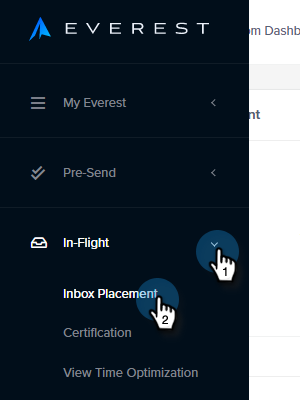
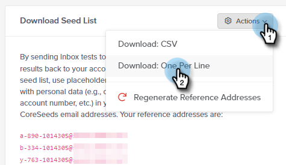

# Power Pack de capacidade de entrega de email: como importar uma lista de seeds {#email-deliverability-power-pack-how-to-import-a-seed-list}

Uma Seed List é uma lista de contas de email em vários provedores de caixa de correio, incluindo Google Apps, Hotmail, Yahoo!, etc., usados para aproximar a taxa de entrega da caixa de entrada versus a pasta de spam. Abaixo estão as etapas para obter essa lista na sua instância do Marketo Engage.

>[!IMPORTANT]
>
>Este artigo é para aqueles que têm uma assinatura ativa do Everest no momento. Se você usa o Controlador de Caixa de Entrada por Bird (antigo MessageBird), seus tutoriais [podem ser encontrados aqui](/help/marketo/product-docs/email-marketing/deliverability/inbox-tracker/inbox-tracker-tutorials.md){target="_blank"}.

## Importar uma lista de seeds {#import-a-seed-list}

1. Em Meu Marketo, selecione **[!UICONTROL Ferramentas de Entrega]**.

   

1. O aplicativo [!DNL Everest] será aberto. Na navegação à esquerda, clique em **[!UICONTROL Em andamento]** e selecione **[!UICONTROL Posicionamento da Caixa de Entrada]**.

   

1. Clique na guia **[!UICONTROL Gerenciar lista de propagação]**.

   

1. Clique no menu suspenso **[!UICONTROL Actions]** e selecione **[!UICONTROL Download: One Per Line]**.

   

   >[!NOTE]
   >
   >Use o Otimizador de Lista de Propagação (na parte superior da página) se desejar que o [!DNL Everest] otimize sua lista para você.

1. Após a exportação, a lista será exibida como um arquivo .txt na pasta de downloads do navegador. Recupere-a e [importe-a](/help/marketo/getting-started/quick-wins/import-a-list-of-people.md) para sua instância do Marketo como uma lista estática.

   

   >[!TIP]
   >
   >Nomeie sua lista de uma forma que facilite a localização.

   >[!CAUTION]
   >
   >Você recebe uma quantidade limitada dessas Campanhas de posicionamento de caixa de entrada por mês. Para ver quantos você recebe, verifique a seção [!UICONTROL Assinatura] em [!UICONTROL Configurações de Conta] > [!UICONTROL Assinatura] em [!DNL Everest]. Para obter mais informações, entre em contato com o representante de vendas da Marketo.

## Adquirir novas Seedlists {#acquiring-new-seedlists}

Sua lista de seeds pode mudar com a mesma frequência que a cada mês. É importante fazer logon no Power Pack Email Deliverability regularmente e verificar o status da sua Seed List. Quando novos endereços forem adicionados ou uma atualização for necessária, você será alertado por meio do ícone Notification no canto inferior esquerdo do aplicativo.

Depois que a lista estática no Marketo for criada, você poderá começar a enviá-la para testar a inserção da caixa de entrada do email.
