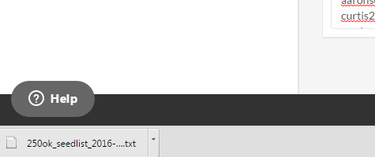

# Pacote de força para entrega por email: Como importar uma lista de sementes {#email-deliverability-power-pack-how-to-import-a-seedlist}

Uma lista semente é uma lista de contas de email em vários provedores de caixa de correio, incluindo aplicativos do Google, Hotmail, Yahoo! etc., que são usadas para aproximar a taxa de entrega da pasta de entrada contra spam. Veja como inserir essa lista na sua instância do Marketo.

>[!AVAILABILITY]
>
>Nem todos os clientes adquiriram essa funcionalidade. Entre em contato com seu representante de vendas para obter detalhes.

## Importar uma Lista de Sedes {#import-a-seedlist}

1. Vá para **Ferramentas de Entrega**.

   

1. Clique em **Informante da Caixa de Entrada**.

   

1. Clique em **Obter Lista de Sedes**.

   

1. Clique em **Exportar Lista**.

   

   >[!NOTE]
   >
   >Escolha **Otimizar Lista** se quiser que 250ok [otimize sua lista](https://support.250ok.com/hc/en-us/articles/216763528-What-is-the-list-optimizer-and-why-should-I-use-it-) para você. Escolha **Personalizar Lista** se quiser selecionar as regiões da lista de sedes que deseja incluir.

1. Após a exportação, a lista será exibida como um arquivo .txt na pasta de downloads do seu navegador. Recupere-o e [importe](/help/marketo/getting-started/quick-wins/import-a-list-of-people.md) para a sua instância do Marketo como uma lista estática.

   

   >[!TIP]
   >
   >Não se esqueça de nomear sua lista de uma forma que facilite sua localização.

   >[!CAUTION]
   >
   >Você obtém uma quantidade limitada dessas Campanhas informantes da caixa de entrada por mês. Para ver quantos são obtidos, veja as **Configurações da conta** 250ok. Para obter mais informações, entre em contato com o representante de vendas do Marketing Cloud.

## Adquirir Novas Seedlists {#acquiring-new-seedlists}

Sua lista de sedimentos pode mudar a cada mês. É importante fazer logon regularmente no e-mail Deliverability Power Pack e verificar o status da sua lista inicial. Quando forem adicionados novos endereços ou for necessária uma atualização na sua extremidade, você será alertado pela interface na página Obter lista de endereços.

Depois que sua lista estática no Marketo é criada, você pode começar a enviá-la para ela para testar o posicionamento da caixa de entrada do seu email.
