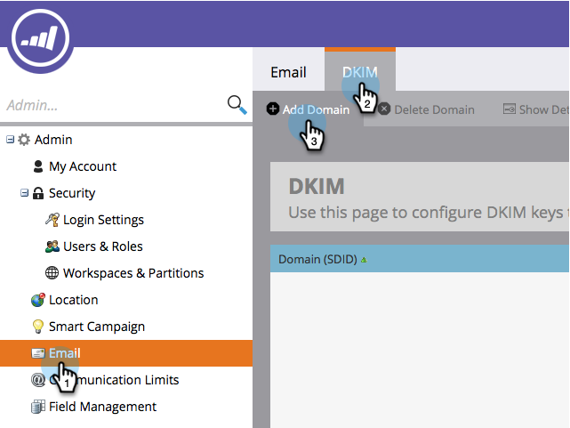

# Configurar uma assinatura DKIM personalizada {#set-up-a-custom-dkim-signature}

Para garantir o melhor fornecimento, assinamos automaticamente todos os emails de saída com uma assinatura DKIM do Marketing Cloud compartilhada.

>[!NOTE]
>
>Você pode precisar da ajuda de sua equipe de TI para concluir algumas das etapas deste artigo.

Você pode personalizar a assinatura DKIM para refletir os domínios de sua escolha. Veja como.

1. Vá para a seção **Admin**.

   

   >[!NOTE]
   >
   >
   >Se você configurar uma assinatura DKIM personalizada da maneira antiga, ela continuará funcionando e deverá aparecer aqui.

1. Clique em **Email**, na guia **DKIM** e, por fim, **Adicionar domínio**.

   

1. Digite o domínio que você usará nos e-mails do Marketo como Endereço de origem e clique em **Adicionar**.

   >[!TIP]
   >
   >
   >Se você usar um domínio diferente em seu Endereço de origem, usaremos a assinatura DKIM compartilhada do Marketo.

   

1. Envie **Registro do host** e **Valor TXT** para a sua TI. Solicite que eles criem o registro para você e verifique se ele se propaga para todos os servidores de nomes associados ao domínio from. A verificação DKIM do Marketo requer que a chave DKIM seja propagada para todos os servidores de nomes associados ao domínio que está sendo assinado pelo DKIM.

   

1. Depois que eles confirmarem que criaram o registro, retorne ao Marketo, selecione seu domínio e clique em **Verificar DNS**.

   

   >[!NOTE]
   >
   >**Lembrete**
   >
   >Se a confirmação falhar e sua TI tiver criado o registro corretamente, isso pode ser uma questão de propagação DNS. Tente novamente mais tarde.

   >[!CAUTION]
   >
   >
   >Modificar/remover o registro DNS correspondente resultará em danos na entrega. Certifique-se de excluir a entrada no Marketo antes de fazer alterações de DNS.

   Isso ajudará com a entrega por email. Você deve obter a validação de que o registro está lá e correto.

