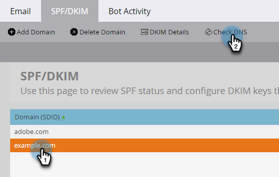

# Configurar uma assinatura DKIM personalizada {#set-up-a-custom-dkim-signature}

Para garantir um delivery de alto nível, assinamos automaticamente todos os emails de saída com uma assinatura DKIM compartilhada do Marketo.

>[!NOTE]
>
>Você pode precisar da ajuda de sua equipe de TI para concluir algumas etapas deste artigo.

Você pode personalizar a assinatura DKIM para refletir os domínios de sua escolha. Veja como.

1. Vá para a **Admin** seção.

   

   >[!NOTE]
   >
   >Se você configurar uma assinatura DKIM personalizada da maneira antiga, ela continuará a funcionar e deverá aparecer aqui.

1. Clique em **E-mail**.

   

1. Clique em **SPF/DKIM** , depois **Adicionar domínio**.

   

1. Insira o domínio que você usará nos emails do Marketo como o Endereço do remetente. Escolha um Seletor e um Tamanho de chave. Clique em **Adicionar** quando terminar.

   

   <table> 
   <tr>
   <td width="20%"><b>Seletor</b></td>
   <td>Uma string/identificador exclusivo que é usado para localizar a parte da chave pública do registro DKIM. Pode ser uma sequência arbitrária ou um identificador exclusivo para separar e identificar a finalidade dessa chave/registro DKIM.</td>
   </tr>
   <tr> 
   <td width="20%"><b>Tamanho da chave</b></td>
   <td>O nível de segurança com o qual você deseja que sua assinatura DKIM seja criptografada.</td>
   </tr>
   </tbody>
   </table>

   

   >[!TIP]
   >
   >* Recomendamos um Tamanho de chave de 2048.
   >* Se você usar um domínio diferente no seu Endereço do remetente, usaremos a assinatura DKIM compartilhada do Marketo.

   >[!IMPORTANT]
   >
   >Se precisar atualizar o Seletor DKIM ou o Tamanho da criptografia DKIM do domínio, exclua o registro existente e publique novamente o registro recém-gerado com os novos valores.
   >
   >Observe que, ao fazer isso, o DKIM não será assinado para o seu domínio até que o novo registro seja publicado e validado pelo nosso sistema. Planeje a alteração de acordo, pois pode levar de 24 a 48 horas até que o novo registro DKIM seja totalmente propagado pela Internet.

1. Envie o **Registro de host** e **Valor TXT** para a sua TI. Peça a eles que criem o registro para você e verifique se ele se propaga para todos os servidores de nomes associados ao domínio do. A verificação DKIM do Marketo exige que a chave DKIM seja propagada para todos os servidores de nomes associados ao domínio que está sendo assinado pelo DKIM.

   

1. Depois de confirmar que criou o registro, volte para a Marketo, selecione seu domínio e clique em **Verificar DNS**.

   

   >[!NOTE]
   >
   >Se a confirmação falhar e o departamento de TI tiver criado o registro corretamente, talvez seja uma questão de propagação de DNS. Tente novamente mais tarde.

   >[!CAUTION]
   >
   >Modificar/remover o registro DNS correspondente resultará em uma capacidade de entrega danificada. Exclua a entrada no Marketo antes de fazer alterações no DNS.

   Isso ajudará com sua capacidade de entrega de email. Você deve obter a validação de que o registro está lá e correto.
