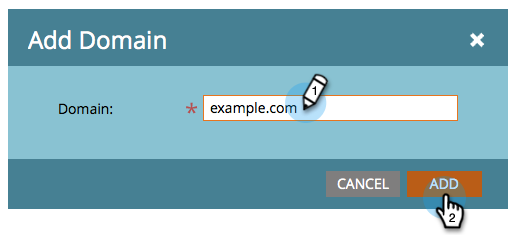

# Configurar uma assinatura DKIM personalizada {#set-up-a-custom-dkim-signature}

Para garantir o deliverability de melhor qualidade, assinamos automaticamente todos os emails de saída com uma assinatura Marketo DKIM compartilhada.

>[!NOTE]
>
>Você pode precisar da ajuda de sua equipe de TI para concluir algumas etapas deste artigo.

Você pode personalizar a assinatura DKIM para refletir os domínios de sua escolha. Veja como.

1. Vá para o **Administrador** seção.

   

   >[!NOTE]
   >
   >Se você configurar uma assinatura DKIM personalizada da maneira antiga, ela continuará a funcionar e deverá aparecer aqui.

1. Clique em **Email**, em seguida, o **DKIM** e finalmente **Adicionar domínio**.

   

1. Insira o domínio que você usará nos emails do Marketo como o Endereço de origem e clique em **Adicionar**.

   >[!TIP]
   >
   >Se você usar um domínio diferente em seu Endereço de origem, usaremos a assinatura DKIM compartilhada pela Marketo.

   

1. Envie o **Registro de host** e **Valor TXT** para sua TI. Peça que eles criem o registro para você e verifique se ele se propaga para todos os servidores de nomes associados ao domínio de origem. A verificação DKIM da Marketo requer que a chave DKIM seja propagada para todos os servidores de nomes associados ao domínio que está sendo assinado por DKIM.

   

1. Depois que eles confirmarem que criaram o registro, volte para a Marketo, selecione seu domínio e clique em **Verificar DNS**.

   

   >[!NOTE]
   >
   >Se a confirmação falhar e a TI tiver criado o registro corretamente, pode ser uma questão de propagação de DNS. Tente novamente mais tarde.

   >[!CAUTION]
   >
   >Modificar/remover o registro DNS correspondente resultará em danos na capacidade de entrega. Exclua a entrada no Marketo antes de fazer alterações de DNS.

   Isso ajudará absolutamente com sua capacidade de fornecimento de email. Você deve obter a validação de que o registro está lá e está correto.
