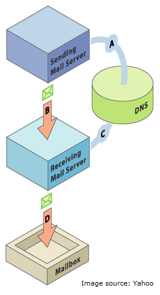

# Configurar a SPF e o DKIM para a sua capacidade de entrega de emails {#set-up-spf-and-dkim-for-your-email-deliverability}

Um método rápido para melhorar as taxas de entrega de emails é incorporar a **SPF** (estrutura de política de remetente) e o **DKIM** (Domain Keys Identified Mail) às configurações do DNS. Com essa adição às entradas de DNS, você informa aos destinatários que autorizou o Marketo a enviar emails em seu nome. Sem essa alteração, o seu email tem uma chance maior de ser marcado como spam, pois foi endereçado do seu domínio, mas enviado de um endereço IP com um domínio do Marketo.

>[!CAUTION]
>
>O administrador de rede precisará fazer essa alteração no registro DNS.

## Configurar a SPF {#set-up-spf}

**Se você NÃO tiver um registro da SPF no seu domínio**

Peça ao administrador da rede que adicione a seguinte linha às suas entradas do DNS. Substitua o [domínio] pelo domínio principal do seu site (por exemplo, “empresa.com”) e o [corpIP] pelo endereço IP do seu servidor de email corporativo (por exemplo, &quot;255.255.255.255&quot;). Se você enviar emails de vários domínios por meio do Marketo, adicione isso a cada domínio (em uma linha).

`[domain] IN TXT v=spf1 mx ip4:[corpIP] include:mktomail.com ~all`

**Se você tiver um registro da SPF no seu domínio**

Se você já tiver um registro da SPF na sua entrada do DNS, basta adicionar o seguinte:

inclua:mktomail.com

## Configurar DKIM {#set-up-dkim}

**O que é o DKIM? Por que devo configurar o DKIM?**

O DKIM é um protocolo de autenticação usado pelos destinatários de email para determinar se uma mensagem de email foi enviada por quem diz que foi enviada. O DKIM geralmente melhora a capacidade de entrega de emails à caixa de entrada, pois um destinatário pode ter certeza de que a mensagem não é falsa.

**Como funciona o DKIM?**

Depois de configurar a chave pública em seu registro DNS e ativar o domínio de envio na seção de Administração (A), o Marketo ativará a assinatura personalizada do DKIM para suas mensagens de saída, que incluirá uma assinatura digital criptografada com cada email enviado em seu nome (B). Os destinatários poderão descriptografar a assinatura digital, procurando a “chave pública” no DNS do domínio do remetente (C). Se a chave no email corresponder à chave no seu registro do DNS, o servidor de email de recebimento terá uma probabilidade maior de aceitar o email que o Marketo enviou em seu nome.

**Como configurar o DKIM?**

Consulte [Configurar uma assinatura personalizada do DKIM](/help/marketo/product-docs/email-marketing/deliverability/set-up-a-custom-dkim-signature.md){target="_blank"}.

>[!MORELIKETHIS]
>
>* Saiba mais sobre o SPF e como ele funciona: `http://www.open-spf.org/Introduction/`
>* A minha SPF está configurada corretamente?: `https://www.kitterman.com/spf/validate.html`
>* Usei a sintaxe correta?: `http://www.open-spf.org/SPF_Record_Syntax/`
