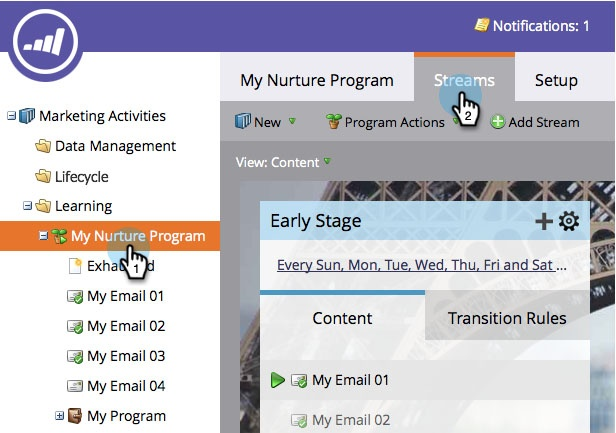

# Adicionar um fluxo {#add-a-stream}

Os programas de engajamento podem conter mais de um fluxo.

1. Acesse **[!UICONTROL Atividades de marketing]**.

   

1. Selecione seu programa de engajamento e clique na guia **[!UICONTROL Fluxos]**.

   

1. Clique em **[!UICONTROL Adicionar fluxo]**.

   

   >[!NOTE]
   >
   >Você pode adicionar até 25 fluxos por programa de envolvimento.

   
