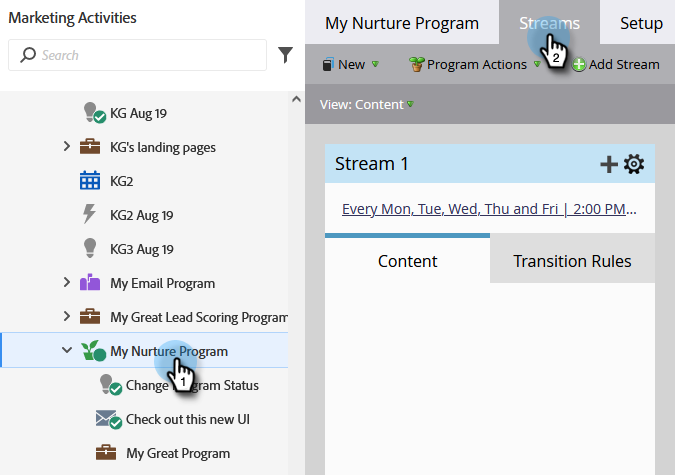

# Adicionar conteúdo a um fluxo {#add-content-to-a-stream}

Depois de criar seu programa de engajamento, é necessário adicionar conteúdo ao(s) fluxo(s). Você pode adicionar emails ou programas a um fluxo.

1. Vá para **[!UICONTROL Atividades de marketing]**.

   

1. Selecione seu programa de envolvimento e vá para a guia **[!UICONTROL Fluxos]**.

   

   Você pode adicionar conteúdo de duas maneiras diferentes:

**Botão Adicionar Conteúdo**

1. Clique no botão **[!UICONTROL Adicionar conteúdo]**.

   

1. Escolha o **[!UICONTROL Email]** _ou_ **[!UICONTROL Programa]** e selecione o email ou programa/campanha inteligente que deseja adicionar.

   

   >[!TIP]
   >
   >Os emails locais para este programa de engajamento serão classificados no topo.

**+ Ícone**

1. Clique no ícone **+**, escolha **[!UICONTROL Email]** _ou_ **[!UICONTROL Programa]** e selecione o email ou programa/campanha inteligente que deseja adicionar.

   

   >[!NOTE]
   >
   >Uma campanha inteligente deve conter o filtro **[!UICONTROL Membro do Programa de Envolvimento]** para que funcione corretamente.

Excelente trabalho! Agora você sabe como adicionar conteúdo aos fluxos do seu programa. Adicione o quanto precisar para sua criação. Consulte o artigo relacionado abaixo para obter mais detalhes.

>[!MORELIKETHIS]
>
>[Adicionando um Programa a um Fluxo de Programa de Envolvimento](/help/marketo/product-docs/email-marketing/drip-nurturing/creating-an-engagement-program/adding-a-program-to-an-engagement-program-stream.md)
