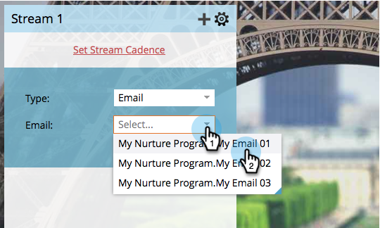

# Adicionar conteúdo a um fluxo {#add-content-to-a-stream}

Depois de criar seu programa de envolvimento, é necessário adicionar conteúdo aos fluxos. Você pode adicionar emails ou programas a um fluxo.

## Adicionar um email a um fluxo {#add-an-email-to-a-stream}

1. Vá para **Marketing Atividade**.

   

1. Selecione seu programa de envolvimento e vá para a guia **Streams** .

   

   Você pode adicionar o primeiro email de três maneiras diferentes:

**Botão Adicionar conteúdo**

1. Clique no botão **Adicionar conteúdo** .

   

1. Deixe o **Tipo** definido como **Email** e selecione o email que deseja adicionar.

   

   >[!TIP]
   >
   >Os emails locais para este programa de envolvimento serão classificados no topo.

**Fluxo + Ícone**

1. Clique no ícone de fluxos **+** , deixe **Tipo** como **Email** e selecione o email que deseja adicionar.

   

**Arrastar e soltar**

1. Basta arrastar o email da árvore para o stream.

   

## Adicionar um Programa a um fluxo {#add-a-program-to-a-stream}

1. Vá para **Marketing Atividade**.

   

1. Selecione seu programa de envolvimento e vá para a guia **Streams** .

   

   Você pode adicionar um programa ao seu fluxo de três maneiras diferentes:

**Botão Adicionar conteúdo**

1. Clique em **Adicionar conteúdo**.

   

1. Alterar **Tipo** para Programa.

   

1. Localize e selecione o programa.

   

1. Agora escolha a campanha inteligente no programa pelo qual você quer que as pessoas corram.

   

   >[!NOTE]
   >
   >**Lembrete**
   >
   >
   >A campanha inteligente deve ter o filtro **Membro do Programa** Envolvimento nele para que isso funcione corretamente.

**Fluxo + Ícone**

1. Clique no ícone de fluxo **+** e, em seguida, altere **Tipo** para Programa.

   

1. Localize e selecione seu programa.

   

1. Selecione a campanha inteligente na qual deseja que as pessoas sejam processadas.

   

**Arrastar e soltar**

1. Arraste e solte o programa de sua escolha da árvore no seu stream.

   

1. Agora, basta escolher a campanha inteligente pela qual você quer que as pessoas fluam.

   

Ótimo trabalho! Agora você conhece diferentes maneiras de adicionar conteúdo aos seus fluxos de programa. Adicione o máximo que precisar para sua criação. Consulte o artigo relacionado abaixo para obter mais detalhes.

>[!MORELIKETHIS]
>
>* [Adicionando um Programa a um fluxo de Programa de envolvimento](adding-a-program-to-an-engagement-program-stream.md)

>

