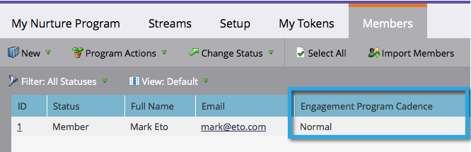

# Noções básicas sobre programas de engajamento {#understanding-engagement-programs}

Os programas de engajamento são projetados para vender para novas pessoas, apresentando o conteúdo a elas de forma sistemática.

>[!NOTE]
>
>Há um limite de 100 programas de envolvimento **ativos** por assinatura.

## Programa de engajamento {#engagement-program}

Um **programa de engajamento** é um tipo de programa que pode realizar atividades complexas com facilidade.

>[!MORELIKETHIS]
>
>[Criar um Programa de Participação](/help/marketo/product-docs/email-marketing/drip-nurturing/creating-an-engagement-program/create-an-engagement-program.md)

## Fluxo {#stream}

Um **fluxo** é um pool de conteúdo priorizado que o programa de envolvimento usará para nutrir as pessoas.

>[!MORELIKETHIS]
>
>* [Adicionar um fluxo](/help/marketo/product-docs/email-marketing/drip-nurturing/creating-an-engagement-program/add-a-stream.md)
>* [Clonar um Fluxo](/help/marketo/product-docs/email-marketing/drip-nurturing/engagement-program-streams/clone-a-stream.md)

## Conteúdo {#content}

Há dois tipos de **conteúdo** que você pode adicionar aos fluxos do programa de engajamento: emails e programas. Os e-mails serão enviados às pessoas no horário do elenco.

>[!MORELIKETHIS]
>
>* [Adicionar conteúdo a um fluxo](/help/marketo/product-docs/email-marketing/drip-nurturing/creating-an-engagement-program/add-content-to-a-stream.md)
>* [Priorizar Conteúdo de Fluxo](/help/marketo/product-docs/email-marketing/drip-nurturing/using-stream-content/prioritize-stream-content.md)
>* [Editar Disponibilidade de Conteúdo de Fluxo](/help/marketo/product-docs/email-marketing/drip-nurturing/using-stream-content/edit-availability-of-stream-content.md)
>* [Remover conteúdo do fluxo](/help/marketo/product-docs/email-marketing/drip-nurturing/using-stream-content/remove-stream-content.md)
>* [Arquivar e Desarquivar Conteúdo de Fluxo](/help/marketo/product-docs/email-marketing/drip-nurturing/using-stream-content/archive-and-unarchive-stream-content.md)

## Elenco {#cast}

Um **cast** é o evento de enviar emails de um Programa de Envolvimento.

>[!NOTE]
>
>Os programas de engajamento não foram projetados para serem usados com emails operacionais.

## Cadência do fluxo {#stream-cadence}

Você decide quando ocorre uma conversão configurando a **cadência de fluxo**. É assim que você agenda o conteúdo para ser enviado em intervalos regulares.

>[!MORELIKETHIS]
>
>[Definir Cadência de Fluxo](/help/marketo/product-docs/email-marketing/drip-nurturing/engagement-program-streams/set-stream-cadence.md)

## Cadência da pessoa {#person-cadence}

A **cadência da pessoa** é um status que define sua capacidade de receber conteúdo de um programa de envolvimento. Você pode usar a etapa de fluxo **Alterar Cadência do Programa de Envolvimento** para alterá-la para Pausado ou Normal.

## Esgotado {#exhausted}

Depois que uma pessoa recebe cada parte do conteúdo de um fluxo, chamamos a pessoa **Exausta**.

>[!MORELIKETHIS]
>
>[Pessoas Com Conteúdo Esgotado](/help/marketo/product-docs/email-marketing/drip-nurturing/using-engagement-programs/people-who-have-exhausted-content.md)

## Nível de engajamento de conteúdo {#content-engagement-level}

O Nível de engajamento de conteúdo é uma pontuação de 0 a 100 pontos que o Marketo dará ao seu conteúdo. Esse número é determinado por uma sofisticada fórmula que utiliza aberturas, cliques, cancelamentos de inscrição, sucesso do programa e outros fatores.

>[!MORELIKETHIS]
>
>[Noções básicas sobre a pontuação de engajamento](/help/marketo/product-docs/email-marketing/drip-nurturing/reports-and-notifications/understanding-the-engagement-score.md)
