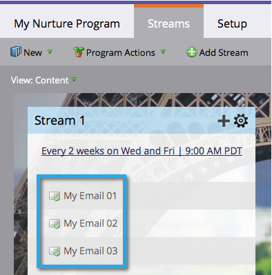

# Noções básicas sobre Programas de envolvimento {#understanding-engagement-programs}

Os programas de envolvimento são projetados para comercializar novas pessoas, apresentando conteúdo para elas de forma sistemática.

>[!NOTE]
>
>Há um limite de 100 **programas de envolvimento ativos** por subscrição.

## Programa de envolvimento {#engagement-program}

Um **envolvimento pr***ograma** é um tipo de programa que pode realizar nutrição complexa com facilidade.

Artigo relacionado:

* [Criar um Programa de envolvimento](create-an-engagement-program.md)

## Fluxo {#stream}

Um **stream** é um pool de conteúdo priorizado que o programa de envolvimento usará para nutrir pessoas.

Artigos relacionados:

* [Adicionar um fluxo](add-a-stream.md)
* [Clonar um fluxo](../../../../product-docs/email-marketing/drip-nurturing/engagement-program-streams/clone-a-stream.md)

## Conteúdo {#content}

Há dois tipos de **content** que você pode adicionar aos fluxos de programas de envolvimento: emails e programas. Os emails serão enviados às pessoas no momento da transmissão.

Artigos relacionados:

* [Adicionar conteúdo a um fluxo](add-content-to-a-stream.md)
* [Priorizar conteúdo de fluxo](../../../../product-docs/email-marketing/drip-nurturing/using-stream-content/prioritize-stream-content.md)
* [Editar disponibilidade de conteúdo de fluxo](../../../../product-docs/email-marketing/drip-nurturing/using-stream-content/edit-availability-of-stream-content.md)
* [Remover conteúdo de fluxo](../../../../product-docs/email-marketing/drip-nurturing/using-stream-content/remove-stream-content.md)
* [Arquivar e desarquivar conteúdo de fluxo](../../../../product-docs/email-marketing/drip-nurturing/using-stream-content/archive-and-unarchive-stream-content.md)

## Converter {#cast}

Um **cast** é a evento de enviar emails de um Programa de Envolvimento.

>[!NOTE]
>
>Os Programas de envolvimento não são projetados para serem usados com e-mails operacionais.

## Cadência de fluxo {#stream-cadence}

Você decide quando um elenco acontece configurando **cadência de fluxo**. É assim que você agenda o conteúdo para sair em intervalos regulares.

&#39; 

`

Artigo relacionado:

* [Definir cadência de fluxo](../../../../product-docs/email-marketing/drip-nurturing/engagement-program-streams/set-stream-cadence.md)

## Cadência da pessoa {#person-cadence}

Uma **cadência de pessoa** é um status que define sua capacidade de receber conteúdo de um programa de envolvimento. Você pode usar a etapa de fluxo **Alterar cadência do Programa de envolvimento** para alterar isso para Pausado ou Normal.

&#39; 

`

## Esgotado {#exhausted}

Depois que uma pessoa recebe cada pedaço de conteúdo em um fluxo, chamamos a pessoa **Exhausted**.

>[!MORELIKETHIS]
>
>* [Pessoas que têm conteúdo esgotado](../../../../product-docs/email-marketing/drip-nurturing/using-engagement-programs/people-who-have-exhausted-content.md)

>

## Nível de envolvimento de conteúdo {#content-engagement-level}

O Nível de envolvimento do conteúdo é uma pontuação de 0 a 100 pontos que o Marketo fornecerá ao seu conteúdo. Esse número é determinado por uma fórmula sofisticada usando abrir, clicar, cancelar a inscrição, sucesso do programa e outros fatores.

>[!MORELIKETHIS]
>
>* [Como entender a pontuação de envolvimento](../../../../product-docs/email-marketing/drip-nurturing/reports-and-notifications/understanding-the-engagement-score.md)

>

