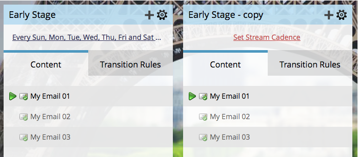

# Clonar um fluxo {#clone-a-stream}

Clonar um fluxo por vários motivos, incluindo o teste de diferentes pedidos e cadências diferentes.

1. Selecione seu programa de envolvimento e acesse **Fluxos** guia .

   

1. Clique no ícone de engrenagem do fluxo e clique em **Clonar**.

   

   >[!NOTE]
   >
   >Você pode ter até 25 fluxos por programa de engajamento.

   Muito bem! Você não ama coisas que tornam sua vida mais fácil?

   

   >[!CAUTION]
   >
   >Tudo no fluxo é clonado exceto pela Cadência. Lembre-se de configurá-lo.
