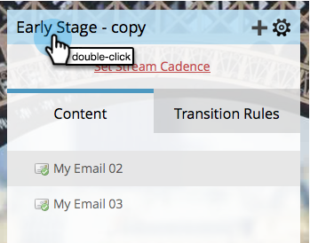

# Renomear um fluxo {#rename-a-stream}

Se quiser se manter organizado, poderá renomear seus fluxos. Veja como fazer isso.

1. Localize e selecione seu programa de envolvimento e clique em **Fluxos**.

   

1. Clique duas vezes no nome do fluxo atual.

   

1. Insira o novo fluxo **Nome** e clique em **Salvar**.

   

   E voila! Agora você sabe como renomear fluxos.
