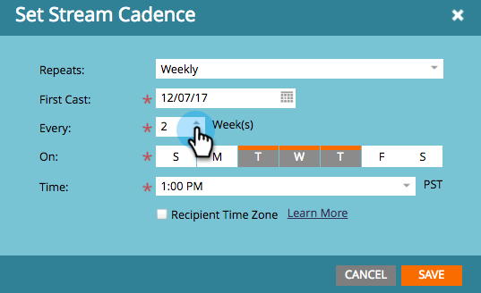
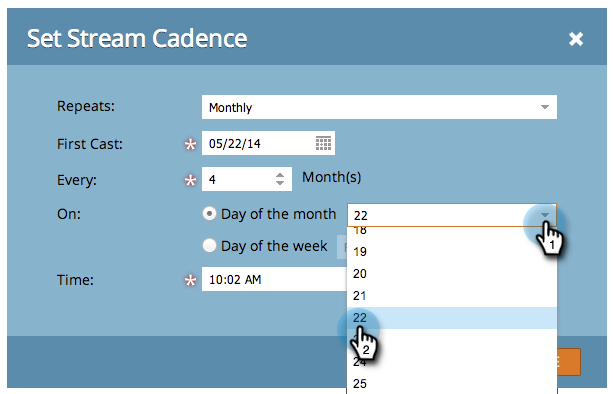

# Definir cadência das transmissões {#set-stream-cadence}

Você pode enviar o conteúdo de envolvimento a qualquer intervalo que desejar. Por exemplo: uma vez por semana ou a cada três terças-feiras do mês.

## Definir cadência {#set-cadence}

1. Vá para **[!UICONTROL Atividades de marketing]**.

   

1. Localize e selecione seu programa de envolvimento, clique na guia **[!UICONTROL Fluxos]** e clique em **[!UICONTROL Definir Cadência de Fluxo]**.

   

1. Selecione com que frequência você deseja que a cadência se repita. Você pode escolher **[!UICONTROL Semanalmente]** ou **[!UICONTROL Mensalmente]**.

## Semanal {#weekly}

1. Selecione **[!UICONTROL Semanalmente]**.

   

   >[!NOTE]
   >
   >Selecionar **[!UICONTROL Nenhum]** desligará o fluxo.

1. Escolha a data da primeira conversão.

   

1. Agora escolha se você quer que a cadência aconteça a cada semana ou mais espaçada. Vamos escolher a cada 2 semanas.

   

1. Decida quais dias da semana. Nesse caso, façamos terça, quarta e quinta.

   

   >[!TIP]
   >
   >Você pode definir sua cadência para execução todos os dias ao escolher **[!UICONTROL Repetições]: [!UICONTROL Semanalmente]** / **[!UICONTROL A cada]: 1 [!UICONTROL Semana]** / **[!UICONTROL Em]**: todos os dias.

   Agora escolha a Hora. Marque a caixa se desejar usar [Fuso Horário do Destinatário](/help/marketo/product-docs/email-marketing/drip-nurturing/engagement-program-streams/set-stream-cadence/schedule-engagement-programs-with-recipient-time-zone.md) (ou seja, entregar de acordo com fusos horários locais) e clique em **[!UICONTROL Salvar]**.

   

   >[!CAUTION]
   >
   >O conteúdo será enviado na data selecionada para o primeiro elenco, portanto, verifique se coincide com o dia da semana escolhida; caso contrário, sairá duas vezes na primeira semana.

1. Passe o mouse sobre a cadência. Você verá em quais dias os futuros elencos sairão.

   

   >[!NOTE]
   >
   >Neste exemplo, um email será enviado na quinta-feira. Em seguida, pulamos uma semana e enviamos novamente na terça, quarta e quinta da semana seguinte. E então repetimos novamente.

Pronto! Continue lendo se quiser configurar uma cadência mensal.

## Mensal {#monthly}

1. Selecione **[!UICONTROL Mensalmente]** para saber com que frequência ele se repete.

   

1. Escolha a data da primeira conversão.

   

1. Selecione se desejar que seja a cada mês ou mais espaçado... Vamos escolher a cada quatro meses.

   

1. Escolha o dia do mês especificado, neste caso, o dia 22 de cada quatro meses.

   

   >[!TIP]
   >
   >Como alternativa, você pode escolher o dia da semana.

1. Escolha uma **[!UICONTROL Hora]** e clique em **[!UICONTROL Salvar]**.

   

1. Passe o mouse sobre a cadência. Você verá em quais dias os futuros elencos sairão.

   

   >[!CAUTION]
   >
   >Se decidir modificar a cadência do fluxo de engajamento posteriormente, verifique se a primeira conversão está definida como uma data futura.

Agora você sabe como configurar uma cadência de fluxo!

>[!MORELIKETHIS]
>
>* [Noções Básicas sobre o Fuso Horário do Destinatário](/help/marketo/product-docs/email-marketing/email-programs/email-program-actions/scheduling-with-recipient-time-zone/understanding-recipient-time-zone.md)
>* [Agendar Programas de Envolvimento com o Fuso Horário do Destinatário](/help/marketo/product-docs/email-marketing/drip-nurturing/engagement-program-streams/set-stream-cadence/schedule-engagement-programs-with-recipient-time-zone.md)
