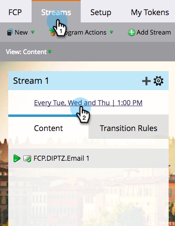
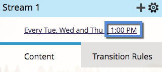

# Agendar programas de engajamento com fuso horário do destinatário {#schedule-engagement-programs-with-recipient-time-zone}

Quando você agendar um fluxo de programa de envolvimento e o fuso horário do recipient estiver ativo, a conversão do programa começará a ser executada à meia-noite no primeiro fuso horário (UTC +14:00). Você precisa agendar o primeiro elenco **pelo menos 25 horas** no futuro, pois pode haver pessoas qualificadas para o elenco em todos os fusos horários do mundo. Iniciar o processamento neste horário no primeiro fuso horário garante que enviaremos o email na data e hora programadas para cada recipient.

1. No seu programa de envolvimento, navegue até a guia **[!UICONTROL Fluxos]** e clique no agendamento de cadência de um fluxo para editá-lo.

   

1. [Defina suas configurações de cadência](/help/marketo/product-docs/email-marketing/drip-nurturing/engagement-program-streams/set-stream-cadence.md) como você faria normalmente e marque a caixa **[!UICONTROL Fuso Horário do Destinatário]**. Lembre-se de que seu primeiro elenco deve ter pelo menos 25 horas no futuro. Clique em **[!UICONTROL Salvar]**.

   

1. Observe que com o Fuso horário do recipient ativo, o agendamento de cadência não mostrará um fuso horário específico, pois pode haver vários. Ele só exibirá a hora.

   

>[!MORELIKETHIS]
>
>* [Noções Básicas sobre o Fuso Horário do Destinatário](/help/marketo/product-docs/email-marketing/email-programs/email-program-actions/scheduling-with-recipient-time-zone/understanding-recipient-time-zone.md)
>* [Definir cadência do fluxo](/help/marketo/product-docs/email-marketing/drip-nurturing/engagement-program-streams/set-stream-cadence.md)
