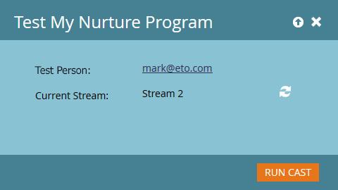

# Testar um fluxo de envolvimento {#test-an-engagement-stream}

Depois de adicionar todo o conteúdo a um fluxo, você pode testá-los um pedaço por vez.

1. Vá para **[!UICONTROL Atividades de marketing]**.

   

1. Selecione seu programa de engajamento.

   

1. Clique em **[!UICONTROL Ações do Programa]** e selecione **[!UICONTROL Testar Fluxo]**.

   

1. Selecione sua pessoa no menu suspenso **[!UICONTROL Pessoa de Teste]**. Lembre-se, o conteúdo realmente será enviado, portanto, lembre-se disso ao escolher.

   

   >[!CAUTION]
   >
   >Certifique-se de que a pessoa de teste seja exclusiva e não tenha duplicatas no banco de dados.

   >[!TIP]
   >
   >Se a pessoa de teste que você está procurando não existir, use a opção **[!UICONTROL Criar pessoa]** para criar uma imediatamente.

   Clique em **[!UICONTROL Fluxo Inicial]**, selecione o fluxo que deseja testar e clique em **[!UICONTROL Executar Conversão]**.
   

1. Depois que a pessoa passar pelas [regras de transição](/help/marketo/product-docs/email-marketing/drip-nurturing/engagement-program-streams/transition-people-between-engagement-streams.md) configuradas anteriormente, clique no ícone Atualizar.

   

1. O novo fluxo será exibido, indicando um teste bem-sucedido.

   

   Bom trabalho!

   >[!NOTE]
   >
   >Nenhum outro conteúdo será enviado, a menos que você clique em **[!UICONTROL Executar conversão novamente]**.
