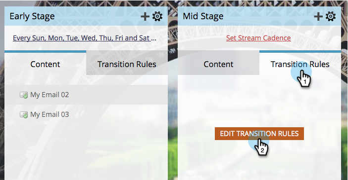

# Fazer a transição de pessoas entre fluxos de engajamento {#transition-people-between-engagement-streams}

Os programas de engajamento podem ter mais de um fluxo. Se você [adicionar um fluxo](/help/marketo/product-docs/email-marketing/drip-nurturing/creating-an-engagement-program/add-a-stream.md), desejará definir uma maneira de as pessoas moverem-se de um fluxo para outro. Elas são chamadas de **regras de transição.**

1. Vá para **[!UICONTROL Atividades de marketing]**.

   

1. Selecione seu programa de envolvimento multi-streaming e vá para **[!UICONTROL Streams]**.

   

1. Clique em **[!UICONTROL Regras de transição]** para o fluxo que você deseja obter de outros fluxos e clique em **[!UICONTROL Editar regras de transição]**.

   

   >[!NOTE]
   >
   >As regras de transição são extraídas em um fluxo; sempre defina as regras no fluxo para o qual você deseja extrair.

   Quando a janela da regra de transição for aberta, localize e arraste o acionador de sua escolha. Nesse caso, queremos mover as pessoas para o [!UICONTROL Estágio intermediário] quando ele for adicionado a uma oportunidade.

   

1. Vamos definir o operador como **[!UICONTROL é qualquer]** para que as pessoas se movam para qualquer oportunidade adicional.

   

   >[!TIP]
   >
   >É possível adicionar vários acionadores e filtros a uma regra de transição, mas a regra de transição usa todos os filtros (usar TODOS os filtros é a única opção). Se você precisar usar OU em uma regra de transição, recomendamos que você configure uma campanha inteligente externa.

1. Clique em **[!UICONTROL Fechar]**.

   

   Ótimo! Agora, qualquer pessoa em seu programa de engajamento que for adicionada a uma oportunidade será movida para o fluxo de [!UICONTROL Estágio intermediário].

   

   >[!NOTE]
   >
   >As etapas descritas acima *não* aplicam-se também às pessoas que estão [em pausa](/help/marketo/product-docs/email-marketing/drip-nurturing/using-engagement-programs/pause-people-in-an-engagement-program.md).
