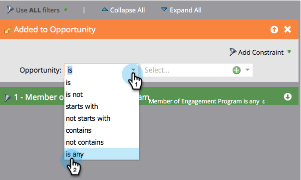

# Transição de pessoas entre fluxos de envolvimento {#transition-people-between-engagement-streams}

Os programas de envolvimento podem ter mais de um fluxo. Se você [adicionar um fluxo](../../../../product-docs/email-marketing/drip-nurturing/creating-an-engagement-program/add-a-stream.md), será necessário definir uma maneira de as pessoas se moverem de um fluxo para outro. São chamadas de regras de **transição.**

1. Vá para **Marketing Atividade**.

   

1. Selecione seu programa de envolvimento com várias linhas e vá para **Streams**.

   

1. Clique em Regras **de** Transição para o fluxo que deseja obter de outros fluxos e clique em **Editar regras de Transição. **

   

   >[!NOTE]
   >
   >As regras de transição entram num fluxo; sempre defina as regras no fluxo que deseja obter.

   Quando a janela da regra de transição for aberta, localize e arraste o seu acionador de escolha. Neste caso, queremos mover pessoas para o Nível Médio quando for adicionado a uma oportunidade.
` 

   `

1. Vamos definir o operador como*** é qualquer** para que as pessoas mudem para qualquer oportunidade adicional.

   ` 

   `

   >[!TIP]
   >
   >Você pode adicionar vários disparadores e filtros a uma regra de transição, mas a regra de transição usa todos os filtros (usar TODOS os filtros é a única opção). Se precisar usar OU em uma regra de transição, recomendamos que você configure uma campanha inteligente externa.

1. Clique em **Fechar**.

   

   Ótimo! Agora qualquer pessoa em seu programa de envolvimento que for adicionada a uma oportunidade será movida para o fluxo de médio estágio.

   ` 

   `

   >[!NOTE]
   >
   >As etapas descritas acima *se aplicam* às pessoas que estão [em pausa](http://docs.marketo.com/display/DOCS/Pause+People+in+an+Engagement+Program) também.

