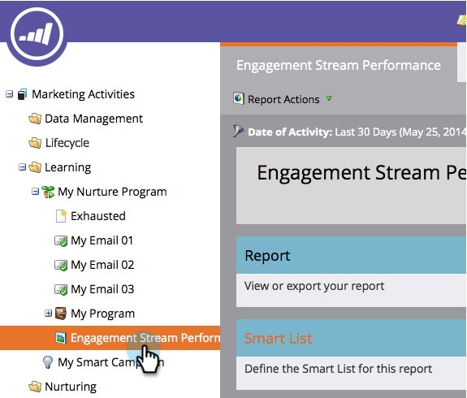

# Relatório de Desempenho de Fluxo de Envolvimento {#engagement-stream-performance-report}

Quer saber como está o desempenho do seu conteúdo de engajamento? Experimente o relatório de desempenho do fluxo de engajamento.

## Criar o relatório {#create-the-report}

1. Localize e selecione seu programa de envolvimento, em **[!UICONTROL Novo]**, clique em **[!UICONTROL Novo ativo local]**.

   

1. Selecione **[!UICONTROL Relatório]**.

   

   >[!TIP]
   >
   >A criação do relatório no programa o restringirá automaticamente ao conteúdo do programa.

   Selecione **[!UICONTROL Desempenho do Fluxo de Envolvimento]** como o relatório **[!UICONTROL Tipo]**.
   

1. Nomeie seu relatório e clique em **[!UICONTROL Criar]**.

   

   Tudo bem! Agora vamos verificar as configurações.

## Editar configurações {#edit-settings}

1. Localize e selecione seu relatório.

   

1. Na guia **[!UICONTROL Configuração]**, clique duas vezes no filtro **[!UICONTROL Emails do programa de envolvimento]**.

   

1. Selecione o(s) email(s) que deseja relatar e clique em **[!UICONTROL Aplicar]**.

   

## Executar relatório {#run-report}

1. Para executar o relatório, basta clicar na guia **[!UICONTROL Relatório]**.

   

   >[!TIP]
   >
   >Embora não ilustrada, a Pontuação de engajamento é uma coluna neste relatório. Consulte [Noções básicas sobre a pontuação do engajamento](/help/marketo/product-docs/email-marketing/drip-nurturing/reports-and-notifications/understanding-the-engagement-score.md) para obter detalhes sobre o que é.

   Excelente trabalho! Observe que o relatório é agrupado por programa de envolvimento.
