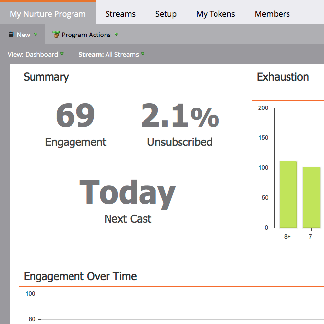

# O Painel Envolvimento {#the-engagement-dashboard}

O Painel Envolvimento é a maneira mais fácil de ver o desempenho do conteúdo em seus [programas de envolvimento](http://docs.marketo.com/display/docs/drip+nurturing).

>[!NOTE]
>
>A pontuação de envolvimento é calculada 72 horas após cada conversão. Saiba mais sobre a [pontuação de envolvimento](understanding-the-engagement-score.md).

## Visualização do Painel Envolvimento {#view-the-engagement-dashboard}

Selecione seu programa de envolvimento e clique em **Visualização > Painel**.

>[!TIP]
>
>Consulte o [relatório de desempenho de fluxo de envolvimento](engagement-stream-performance-report.md) para obter estatísticas mais detalhadas.

## Entenda o Widget de exaustão {#understand-the-exhaustion-widget}

Este widget ajuda você a antecipar quando os clientes em potencial terão esgotado todo o conteúdo. A pontuação de exaustão é calculada imediatamente após cada elenco. O exemplo abaixo mostra que em 1 cast, 195 clientes potenciais terão esgotado todo o conteúdo.

>[!NOTE]
>
>Você deve acessar a guia Configuração e verificar se as Notificações de conteúdo esgotadas estão **Ativadas** para ver o gráfico acima. Se estiverem fora, o gráfico parecerá diferente.

>[!CAUTION]
>
>As pessoas que estão &quot;exaustas&quot; não receberão nenhuma comunicação no próximo elenco.

## Entenda o Widget Envolvimento ao longo do tempo {#understand-the-engagement-over-time-widget}

Mostra a pontuação de envolvimento média ao longo do tempo e o impacto das edições de conteúdo.

>[!NOTE]
>
>**Disponibilidade**
>
>Este recurso está disponível como um complemento para clientes que utilizam o Explorador do Ciclo de Receita do Marketo. Entre em contato com o Gerente de sucesso do cliente para obter mais detalhes.

Para mostrar um único conteúdo em vez de uma média, clique no ícone de engrenagem e selecione o conteúdo.

## Entenda o Widget de maior envolvimento {#understand-the-highest-engagement-widget}

Uma lista de todo o conteúdo, ordenada pela pontuação de envolvimento mais alta.

Para alterar a classificação, clique no ícone de engrenagem e selecione a ordem de classificação.

** Novo e  ** Oldestare com base na hora da última aprovação.

>[!NOTE]
>
>**Mergulho profundo**
>
>Saiba mais no mergulho profundo [Crie um Programa de envolvimento](../../../../product-docs/email-marketing/drip-nurturing/creating-an-engagement-program/create-an-engagement-program.md).

