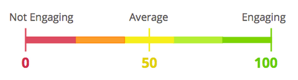
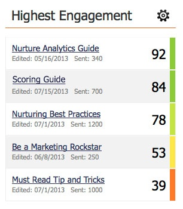

# Noções básicas sobre a pontuação de engajamento {#understanding-the-engagement-score}

A pontuação de engajamento facilita a visualização da eficiência do conteúdo em seu programa de engajamento. A pontuação varia de 0 a 100. Confira [o Painel de Envolvimento](/help/marketo/product-docs/email-marketing/drip-nurturing/reports-and-notifications/the-engagement-dashboard.md) para ver como você pode acompanhar o desempenho do seu conteúdo.

A pontuação é baseada em um algoritmo proprietário que leva em conta o comportamento envolvido ([!UICONTROL Abrir], [!UICONTROL Clicar], [!UICONTROL Êxito do Programa]) e o comportamento desconectado ([!UICONTROL Cancelar Inscrição]). Ele é comparado a emails de estilo de gotejamento e nutrição para fornecer uma média de 50. Para dar às pessoas a chance de se envolver com seu conteúdo, a pontuação de engajamento é calculada 72 horas após cada elenco. Além disso, a pontuação só cobre dados de **suas últimas três** execuções.

>[!NOTE]
>
>Quando programas são usados como conteúdo em fluxos, a pontuação de envolvimento é baseada na associação ao programa e no status de sucesso, **não** interação por email (cliques, aberturas, cancelamentos de assinatura).

As pontuações de engajamento são universais para todos os clientes. Você pode compará-los para ver quem tem o conteúdo mais envolvente.

>[!NOTE]
>
>O algoritmo proprietário também se aplica à pontuação de engajamento em programas de email.

>[!MORELIKETHIS]
>
>[Noções Básicas sobre Programas de Participação](/help/marketo/product-docs/email-marketing/drip-nurturing/creating-an-engagement-program/understanding-engagement-programs.md)
