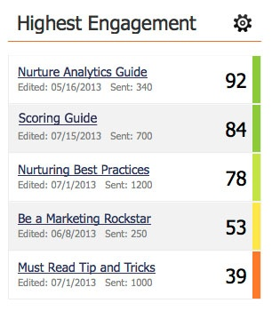

# Como entender a pontuação de envolvimento {#understanding-the-engagement-score}

A pontuação de envolvimento facilita a visualização da eficácia do conteúdo em seu programa de envolvimento. A pontuação varia de 0 a 100. Confira [o Painel](the-engagement-dashboard.md) Envolvimento para ver como você pode acompanhar o desempenho do seu conteúdo.

A pontuação é baseada em um algoritmo proprietário que considera o comportamento engajado (Aberto, Clique, Sucesso do Programa) e o comportamento desengatado (Cancelar inscrição). É comparada com e-mails com estilo gotejar e nutrir para dar uma média de 50. Para dar às pessoas a oportunidade de se envolverem com seu conteúdo, a pontuação de envolvimento é calculada 72 horas após cada conversão.

>[!NOTE]
>
>Quando os programas são usados como conteúdo em fluxos, a pontuação de envolvimento se baseia na associação ao programa e no status de sucesso, **não** na interação por email (cliques, aberturas, cancelamento de assinaturas).

As pontuações de envolvimento são universais para todos os clientes. Você pode compará-los para ver quem tem o conteúdo mais envolvente.

>[!NOTE]
>
>O algoritmo proprietário também se aplica à pontuação de envolvimento em programas de email.

>[!NOTE]
>
>**Artigos relacionados**
>
>* [Noções básicas sobre Programas de envolvimento](../../../../product-docs/email-marketing/drip-nurturing/creating-an-engagement-program/understanding-engagement-programs.md)

>

