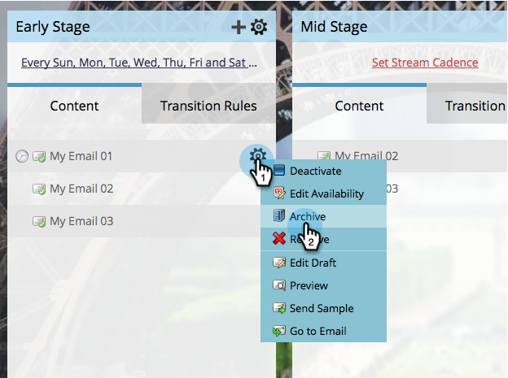

# Arquivar e desarquivar conteúdo de fluxo {#archive-and-unarchive-stream-content}

Se não quiser mais usar um conteúdo em um fluxo, você pode [removê-lo](/help/marketo/product-docs/email-marketing/drip-nurturing/using-stream-content/remove-stream-content.md) ou arquivá-lo. Veja como arquivar conteúdo.

>[!TIP]
>
>A remoção destrói toda a história associada; o arquivamento o preserva.

## Arquivar conteúdo de fluxo {#archive-stream-content}

1. Selecione seu programa de envolvimento e vá para a guia **Streams**.

   

1. Passe o cursor do mouse sobre o e-mail que deseja arquivar e, em seguida, no ícone de engrenagem, clique em **Arquivar**.

   

   É isso! Lembre-se, arquive se quiser preservar o histórico.

## Desarquivar Conteúdo de Fluxo {#unarchive-stream-content}

1. Selecione seu programa de envolvimento e vá para a guia **Streams**.

   

1. Clique no ícone de engrenagem do seu fluxo e clique em **Mostrar conteúdo arquivado**.

   

1. Agora que você pode ver o conteúdo arquivado, clique no ícone de engrenagem do conteúdo que deseja desarquivar e clique em **Desarquivar**.

   

   Perfeito! Agora, esse conteúdo está disponível para priorização e ativação.
