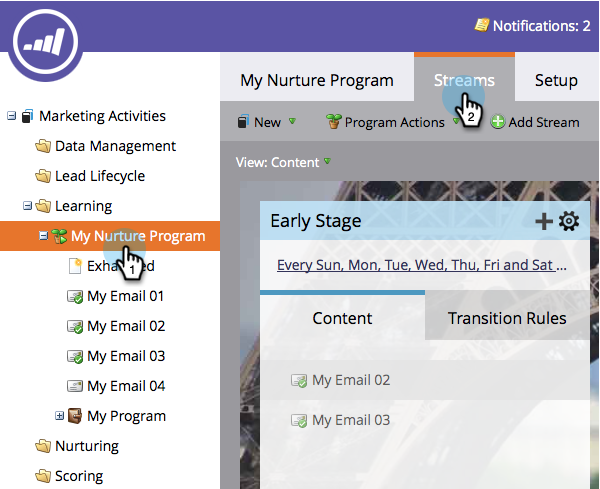
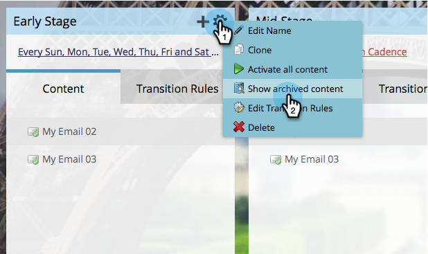
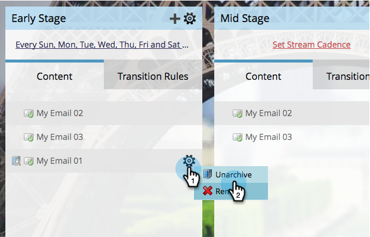

# Arquivar e desarquivar conteúdo de fluxo {#archive-and-unarchive-stream-content}

Se você não quiser mais usar um conteúdo em um fluxo, é possível [removê-lo](/help/marketo/product-docs/email-marketing/drip-nurturing/using-stream-content/remove-stream-content.md) ou arquivá-lo. Veja como arquivar o conteúdo.

>[!TIP]
>
>A remoção destrói todo o histórico associado; o arquivamento o preserva.

## Arquivar conteúdo de fluxo {#archive-stream-content}

1. Selecione seu programa de envolvimento e vá para a guia **[!UICONTROL Fluxos]**.

   

1. Passe o cursor do mouse sobre o email que deseja arquivar e, sob o ícone de engrenagem, clique em **[!UICONTROL Arquivar]**.

   

   Pronto! Lembre-se de arquivar se quiser preservar o histórico.

## Desarquivar conteúdo de fluxo {#unarchive-stream-content}

1. Selecione seu programa de envolvimento e vá para a guia **[!UICONTROL Fluxos]**.

   

1. Clique no ícone de engrenagem do seu fluxo e clique em **[!UICONTROL Mostrar conteúdo arquivado]**.

   

1. Agora que você pode ver o conteúdo arquivado, clique no ícone de engrenagem do conteúdo que deseja desarquivar e clique em **[!UICONTROL Desarquivar]**.

   

   Perfeito! Agora esse conteúdo está disponível para ser priorizado e ativado.
