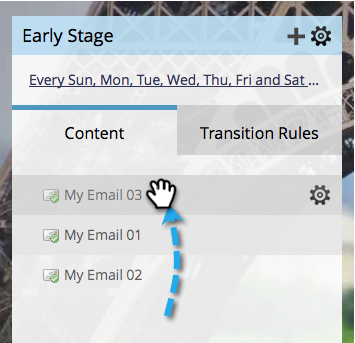

# Priorizar conteúdo de fluxo {#prioritize-stream-content}

Depois de adicionar conteúdo ao seu fluxo, você pode alterar a prioridade. O conteúdo é sempre entregue de cima para baixo em cada elenco, e nenhum conteúdo é enviado para a mesma pessoa duas vezes.

1. Vá para **Atividades de marketing**.

   

1. Selecione seu programa de envolvimento e clique na guia **Streams**.

   

1. Agora, basta arrastar e soltar o conteúdo na ordem desejada.

   

   >[!NOTE]
   >
   >A prioridade sempre será lida de cima para baixo no momento do elenco.

   É tão fácil! Agora você sabe como priorizar seu conteúdo de fluxo.
