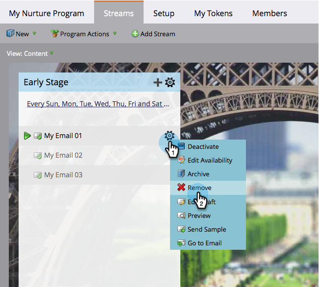

# Remover conteúdo do fluxo {#remove-stream-content}

Você pode remover ou arquivar um conteúdo. Ao contrário da remoção do conteúdo de fluxo, o [arquivamento](/help/marketo/product-docs/email-marketing/drip-nurturing/using-stream-content/archive-and-unarchive-stream-content.md) preserva todo o histórico associado ao conteúdo. Se você não se importar em perder as estatísticas históricas de algum conteúdo e quiser removê-lo, veja como fazer isso.

1. Vá para **[!UICONTROL Atividades de marketing]**.

   

1. Selecione seu programa de engajamento e clique na guia **[!UICONTROL Fluxos]**.

   

1. Passe o mouse sobre o conteúdo que deseja remover, clique no ícone de engrenagem quando ele aparecer e clique em **[!UICONTROL Remover]**.

   

   >[!CAUTION]
   >
   >Remova o conteúdo somente se você não se importar com o histórico. Se quiser preservar o histórico, [arquive-o](/help/marketo/product-docs/email-marketing/drip-nurturing/using-stream-content/archive-and-unarchive-stream-content.md).

   Pronto! Agora você sabe como remover um conteúdo.
