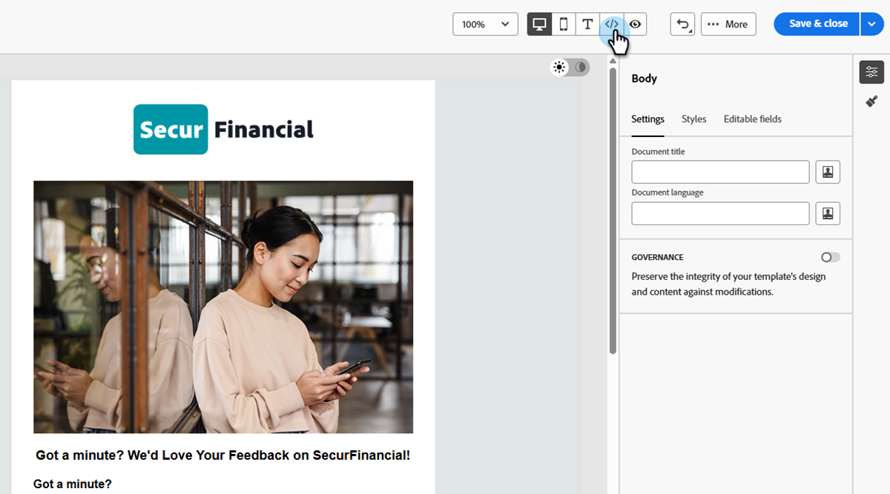

# Editar modelos de email com o editor avançado do HTML {#advanced-html-mode}

O modo HTML avançado permite exibir e editar o código fonte bruto de modelos de email diretamente da interface do Designer de email do [!DNL Marketo Engage].

Esse recurso permite inserir expressões avançadas diretamente na origem. Ao voltar para a visualização visual (desktop), o conteúdo é renderizado novamente para que você possa verificar sua aparência e continuar editando em ambas as visualizações.

## Medidas de proteção {#guardrails}

Ao usar o editor avançado do HTML, as seguintes medidas de proteção protegem a compatibilidade do conteúdo e definem expectativas.

* O editor avançado do HTML **não valida** seu código. Ele não verifica erros de sintaxe ou layouts com falha. Revise seu conteúdo cuidadosamente antes de salvar.

* Atualizações futuras do sistema podem substituir as alterações feitas na marcação padrão. **As alterações não podem persistir**.

* [!DNL Adobe] suporte **não pode solucionar ou resolver** problemas causados por código personalizado e alterações manuais. Mantenha um backup do seu conteúdo caso precise reverter.

* Não é possível simular conteúdo na visualização avançada do HTML. Alterne para o modo de exibição de Área de Trabalho para visualizar seu conteúdo.

* Para garantir a compatibilidade do conteúdo, **não é possível salvar** no modo de exibição avançado do HTML. Volte para a exibição da área de trabalho quando estiver pronto para salvar suas alterações.

## Acessar o modo HTML avançado {#access-html-mode}

Para abrir o editor avançado do HTML e editar a fonte do modelo, siga estas etapas.

1. Abra ou [crie um modelo de email](/help/marketo/product-docs/email-marketing/email-designer/email-template-authoring.md#create-an-email-template) no Designer de email.

1. Na tela _Editar modelo de email_, clique no botão HTML no canto superior direito.

   {width="800" zoomable="yes"}

1. Na primeira vez que você abrir o editor avançado do HTML, uma mensagem de aviso será exibida. Revise e clique em **[!UICONTROL OK]** quando terminar.

   

   >[!NOTE]
   >
   >Este aviso é exibido na primeira vez que você abre o editor avançado do HTML e redefine a cada mês.

1. O editor avançado do HTML é exibido.

   {width="800" zoomable="yes"}

1. Adicione as alterações desejadas ao conteúdo do email.

   >[!WARNING]
   >
   >Insira o código HTML e CSS correto, pois não há um processo de validação de sintaxe e o Suporte da Adobe não pode ajudar com as edições do HTML.

1. A simulação e o salvamento de conteúdo não estão disponíveis na visualização avançada do HTML por motivos de compatibilidade. Volte para a exibição da área de trabalho para visualizar seu conteúdo e salvar suas alterações.

   {width="800" zoomable="yes"}

   >[!NOTE]
   >
   >As edições são preservadas ao alternar entre exibições.
