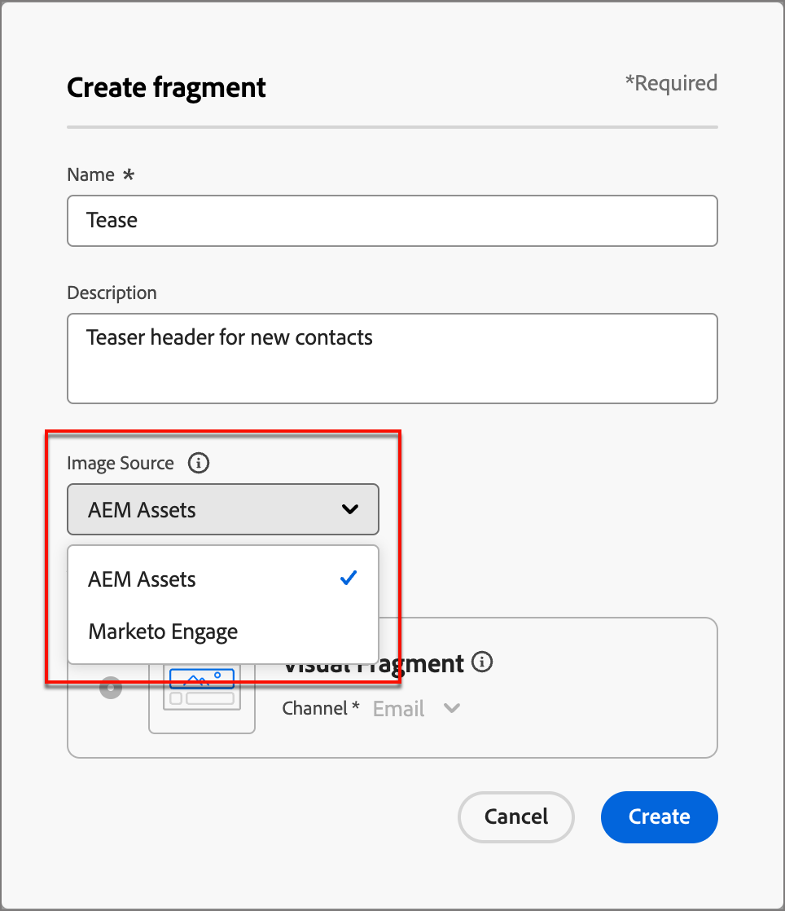

# Trabalhar com ativos do Experience Manager {#work-with-experience-manager-assets}

Quando o _Adobe Experience Manager Assets as a Cloud Service_ é integrado ao Adobe Marketo Engage, você pode acessar facilmente ativos digitais para usar em seu conteúdo de marketing.

>[!PREREQUISITES]
>
>[Conecte o Adobe Experience Manager Cloud Service à sua instância do Adobe Marketo Engage](/help/marketo/product-docs/email-marketing/email-designer/aem-cloud-services.md){target="_blank"}

>[!NOTE]
>
>Atualmente, apenas ativos de imagem do _Adobe Experience Manager Assets_ são suportados no Marketo Engage. As alterações nos ativos devem ser feitas pelo repositório central da Adobe Experience Manager Assets. [Saiba mais](https://experienceleague.adobe.com/en/docs/experience-manager-cloud-service/content/assets/manage/manage-digital-assets){target="_blank"}

Quando você usa esses ativos digitais, as alterações mais recentes no _Assets as a Cloud Service_ se propagam automaticamente para campanhas de email ativas por meio de referências vinculadas. Se as imagens forem excluídas no _Adobe Experience Manager Assets as a Cloud Service_, elas aparecerão com uma referência corrompida em seus emails. Quando os ativos que estão sendo usados no momento no Marketo Engage são modificados ou excluídos, os autores de email são notificados sobre as alterações na imagem. Todas as alterações nos ativos devem ser feitas no repositório central da Adobe Experience Manager Assets.

## Usar o AEM Assets como fonte de imagem {#use-aem-assets-as-the-image-source}

Se o ambiente tiver uma ou mais conexões do repositório de ativos, você poderá designar o AEM Assets como fonte para ativos ao criar ou exibir detalhes de um email, modelo de email ou fragmento visual.

* Ao criar novo conteúdo, escolha `AEM Assets` como o item **[!UICONTROL Image Source]** na caixa de diálogo.

{width="400"}

* Ao abrir um recurso de conteúdo existente, escolha `AEM Assets` na seção _[!UICONTROL Corpo]_ à direita.

{width="700" zoomable="yes"}

## Acessar ativos para criação {#access-assets-for-authoring}

>[!IMPORTANT]
>
>Um administrador deve adicionar usuários que precisam de acesso aos ativos aos perfis do produto Usuários do consumidor do Assets e/ou Usuários do Assets. [Saiba mais](https://experienceleague.adobe.com/en/docs/experience-manager-cloud-service/content/security/ims-support#managing-products-and-user-access-in-admin-console)

No editor de conteúdo visual, clique no ícone _Seletor de ativos de Experience Manager_ na barra lateral esquerda. Isso altera o painel Ferramentas para uma lista de ativos disponíveis no repositório selecionado.

{width="700" zoomable="yes"}

Se você tiver mais de um repositório AEM conectado, clique no botão **[!UICONTROL Gerenciar como]** para escolher o repositório que deseja usar.

{width="700" zoomable="yes"}

Escolha o repositório desejado.

Há vários métodos para adicionar um ativo de imagem à tela visual:

* Arraste e solte uma miniatura de imagem da navegação à esquerda.

{width="700" zoomable="yes"}

* Adicione um componente de imagem à tela e clique em **[!UICONTROL Procurar]** para abrir a caixa de diálogo _[!UICONTROL Selecionar Assets]_.

  Na caixa de diálogo, é possível escolher uma imagem do repositório selecionado.

  Há várias ferramentas disponíveis para ajudá-lo a localizar o ativo que você precisa.

{width="700" zoomable="yes"}

* Altere o **[!UICONTROL Repositório]** na parte superior direita.

* Clique em **[!UICONTROL Gerenciar ativos]** na parte superior direita para abrir o repositório do Assets em outra guia do navegador e usar as ferramentas de gerenciamento do AEM Assets.

* Clique no seletor de _Tipo de exibição_ na parte superior direita para alterar a exibição para **[!UICONTROL Exibição de Lista]**, **[!UICONTROL Exibição de Grade]**, **[!UICONTROL Exibição de Galeria]** ou **[!UICONTROL Exibição em Cascata]**.

* Clique no ícone _Ordem de classificação_ para alterar a ordem de classificação entre crescente e decrescente.

* Clique na seta de menu **[!UICONTROL Classificar por]** para alterar os critérios de classificação para **[!UICONTROL Nome]**, **[!UICONTROL Tamanho]** ou **[!UICONTROL Modificado]**.

* Clique no ícone _Filtro_ na parte superior esquerda para filtrar os itens exibidos de acordo com seus critérios.

* Insira texto no campo Pesquisar para filtrar os itens exibidos para uma correspondência do nome do ativo.

{width="700" zoomable="yes"}
