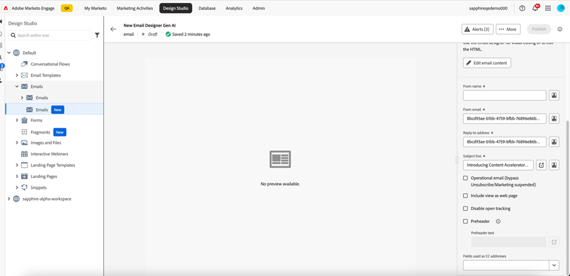
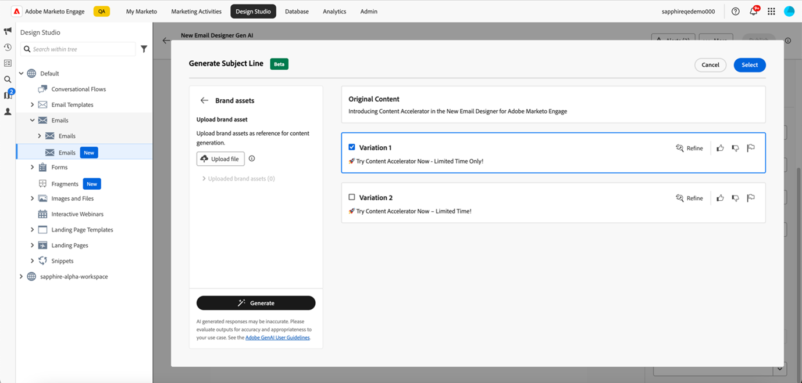
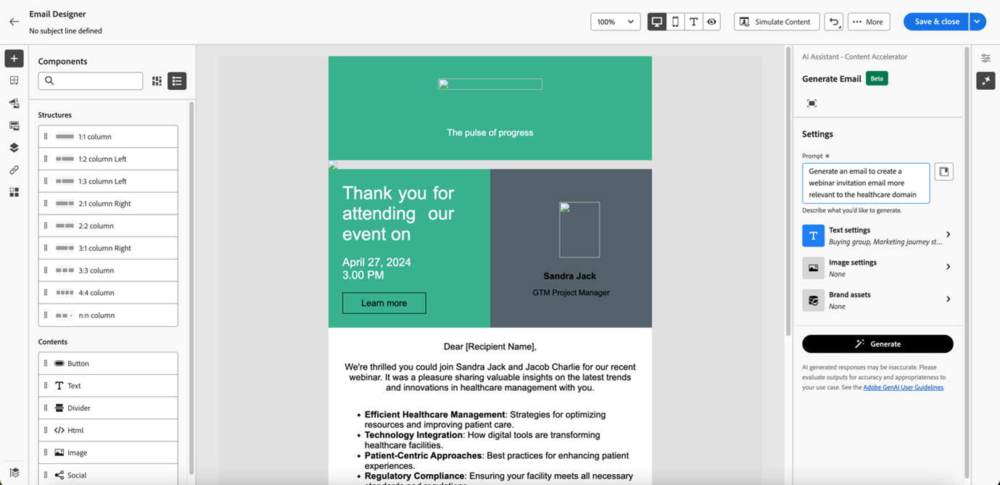

# Usar o Assistente de IA {#use-ai-assistant}

O Assistente de IA no Marketo Engage Email Designer ajuda você a criar e-mails contemporâneos, com desempenho e intuitivos. Isso é feito por meio da tecnologia de IA gerativa da Adobe e da biblioteca de prompts, juntamente com o Firefly, para geração de imagens, que auxilia na criação de conteúdo adequado para um determinado grupo de persona/compras, estágio de jornada de marketing, estratégia de comunicação, tom etc. Ativos de marca específicos também podem ser utilizados para criar conteúdo.

>[!PREREQUISITES]
>
>O Assistente de IA não está ativado por padrão. Primeiro, você deve concordar com os [termos principais da Gen-AI e os termos complementares](https://www.adobe.com/legal/terms/enterprise-licensing/genai-ww.html){target="_blank"} para usar a funcionalidade da Gen-AI no Designer de email. Entre em contato com a Equipe de conta da Adobe (seu gerente de conta) para obter detalhes.

## Configurar permissões {#set-up-permissions}

_Após_ seguir o pré-requisito acima, os administradores do Marketo devem aplicar acesso a usuários/funções específicos antes que os usuários vejam os botões GenAI.

1. No Marketo Engage, clique em **Administrador** e selecione **Usuários e funções**.

   

1. Na guia **Funções**, clique duas vezes na função desejada.

   

1. Em _Access Design Studio_, marque a caixa de seleção **Acessar Assistente de IA** e clique em **Salvar**.

   

1. Clique na guia Usuários e selecione o usuário ao qual deseja fornecer acesso.

   

1. Selecione a função escolhida na Etapa 3 e o espaço de trabalho desejado (se aplicável). Clique em **Salvar**.

   

## Casos de uso {#use-cases}

Existem três casos de uso principais para o Assistente de IA:

* [Crie uma linha de assunto](#create-a-subject-line) para seu email
* [Criar conteúdo para uma seção específica](#create-content-for-a-specific-section) do seu email
* [Criar um email inteiro](#create-an-entire-email) a partir de um modelo selecionado

## Criar uma linha de assunto {#create-a-subject-line}

Quando um email for criado usando a Nova Designer de email, insira uma linha de assunto temporária.

Após a criação do email, a linha de assunto fica na coluna _Detalhes_ à direita. Clique no botão do assistente de IA (  ) ao lado dele para obter assistência na criação de uma nova linha de assunto usando a funcionalidade Gen AI.

Habilite a opção **Usar conteúdo de referência** para que o Assistente de IA personalize o novo conteúdo com base no conteúdo selecionado.

Digite o prompt para personalizar a linha do assunto. Insira configurações de texto relevantes e faça upload de quaisquer ativos de marca que você deseja usar como referência para criar uma linha de assunto apropriada.

As configurações de texto incluem:

<table><tbody>
  <tr>
    <td style="width:25%"><b>Grupos de compras</b></td>
    <td>Grupo de compras específico que você está direcionando (por exemplo, Profissional, Influenciador, Tomador de decisão).</td>
  </tr>
  <tr>
    <td style="width:25%"><b>Estágio de Jornada de marketing</b></td>
    <td>Recipients em um estágio de jornada de marketing específico (por exemplo, Descubra, Avaliar, Confirmar).</td>
  </tr>
  <tr>
    <td style="width:25%"><b>Estratégia de comunicação</b></td>
    <td>O objetivo da comunicação (por exemplo, urgente, prova social, informativo).</td>
  </tr>
  <tr>
    <td style="width:25%"><b>Idioma</b></td>
    <td>Idioma no qual você deseja que a linha de assunto seja gerada.</td>
  </tr>
  <tr>
    <td style="width:25%"><b>Tom</b></td>
    <td>Tom no qual você deseja que o conteúdo seja gerado (por exemplo, Inspirador, Emocionante, Humorístico).</td>
  </tr>
  <tr>
    <td style="width:25%"><b>Emojis</b></td>
    <td>Permite que emojis sejam incluídos no conteúdo gerado.</td>
  </tr>
</tbody>
</table>

Ao clicar em **Gerar**, as amostras são exibidas para você escolher:

Também é possível fazer upload de um ativo da marca para usar o conteúdo dentro do ativo como uma referência para criar a linha de assunto.

Para escolher uma variação, marque a caixa de seleção e clique em **Selecionar**. Você também pode ajustá-lo clicando em **Refinar**. Além disso, você pode fornecer feedback clicando no ícone com os polegares para cima ou para baixo para que a tecnologia Gen-AI aprenda suas preferências.

Depois de fazer a seleção, a Linha de assunto é preenchida nos Detalhes do email.

## Crie conteúdo para uma seção específica do seu email {#create-content-for-a-specific-section}

Após a criação do email, você tem a opção de modificar determinadas seções, imagens ou texto.

Neste exemplo, estamos usando um modelo de assistência médica. Se a imagem existente do especialista em saúde não atender às suas necessidades, você pode instruir o assistente de IA a criar sua própria imagem de um especialista em saúde. Basta selecionar o conteúdo da imagem e clicar em Assistente de IA.

Insira os detalhes relevantes no prompt, como &quot;gere uma imagem para um especialista da área de saúde&quot;, e adicione qualquer personalização desejada. Você também pode usar a biblioteca de prompts (à direita do prompt) se não tiver certeza sobre o que inserir.

Depois de clicar em **Gerar**, várias variantes são criadas para você escolher.

Assim como a imagem, partes de texto do email também podem ser modificadas.

## Criar um email inteiro a partir de um modelo selecionado {#create-an-entire-email}

Essa opção só estará disponível se o email for criado usando um template existente. Pode ser um template padrão fornecido pelo Designer de email, um template salvo que você já criou ou um template importado usando a opção Import HTML. Esta opção não estará disponível se você escolher [Criar do Zero](/help/marketo/product-docs/email-marketing/email-designer/email-authoring.md#design-from-scratch) para seu email.

Selecione um modelo, sem selecionar nenhum componente no modelo, e clique no botão Assistente de IA no Designer de email.

Insira o prompt relevante e escolha as configurações de texto, os ativos de marca e qualquer configuração de imagem desejada para seu email.

Se você quiser gerar imagens usando o Firefly, selecione as Configurações de Imagem e selecione o alternador para **Gerar Imagens usando a IA**.

Selecione o _Tipo de Conteúdo_, _Cor e Tom_, _Luminosidade_ e _Composição_ desejados para criar imagens Gen-AI para seu email. Clique em **Gerar** quando terminar.

Veja como uma variação será exibida em seu email clicando em **Visualizar**. Escolha uma variação clicando em **Aplicar**.
