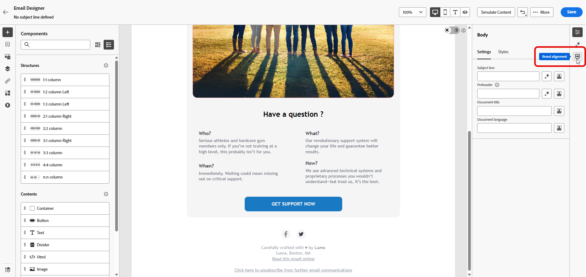

# Pontuação da marca {#brand-score}

Analisar a pontuação da sua marca garante a consistência no tom, nas mensagens e na identidade visual em todas as campanhas de email, além de servir como uma verificação de qualidade antes do conteúdo ser publicado.

>[!AVAILABILITY]
>
>Você deve concordar com o [contrato de usuário](https://www.adobe.com/legal/licenses-terms/adobe-dx-gen-ai-user-guidelines.html){target="_blank"}{target="_blank"} antes de usar o Assistente de IA no Adobe Marketo Engage. Para obter mais informações, entre em contato com o seu representante da Adobe.

## Validar seu conteúdo com o alinhamento da marca {#validate-content}

Depois que sua marca for [configurada e publicada](/help/marketo/product-docs/email-marketing/email-designer/brands/manage-brands.md#create-brand-kit){target="_blank"}, avalie a pontuação de alinhamento da marca diretamente em sua campanha de email para garantir que o conteúdo esteja alinhado às diretrizes da marca.

1. No email, clique no ícone **[!UICONTROL Alinhamento da marca]**.

   Seu conteúdo avalia automaticamente sua [marca padrão](/help/marketo/product-docs/email-marketing/email-designer/brands/manage-brands.md#default-brand){target="_blank"}.

   {width="800" zoomable="yes"}

1. Para avaliar usando uma marca diferente, selecione-a no menu suspenso **[!UICONTROL Marca]** e clique em **[!UICONTROL Avaliar pontuação]**.

   {width="800" zoomable="yes"}

1. Navegue pelo **[!UICONTROL Estilo de escrita]** ou **[!UICONTROL Conteúdo visual]** para ver mais informações sobre sua pontuação.

   {width="800" zoomable="yes"}

1. Clique no ícone  para obter uma exibição detalhada da sua pontuação de qualidade.

   {width="800" zoomable="yes"}

1. Selecione qualquer diretriz sinalizada para exibir comentários e sugestões específicos. O alinhamento da marca avalia as seguintes categorias:

   * **[!UICONTROL Estilo de escrita]**:
      * **[!UICONTROL Estilo de comunicação da marca]**: define a personalidade e o tom emocional para garantir uma voz consistente da marca em todos os canais.
      * **[!UICONTROL Padrões de mensagem da marca]**: regras estruturais e de formatação para texto promocional e de marketing eficaz.
      * **[!UICONTROL Padrões de conformidade legal]**: garante que todas as comunicações estejam em conformidade com os requisitos legais, incluindo a colocação de texto e listas de verificação de conformidade.

   * **[!UICONTROL Conteúdo visual]**:
      * **[!UICONTROL Padrões de fotografia]**: requisitos para conteúdo fotográfico, incluindo resolução, composição, iluminação e formatos de arquivo.
      * **[!UICONTROL Padrões de ilustração]**: parâmetros de estilo, espessura da linha, uso de cor e requisitos de formato de arquivo para ilustrações.
      * **[!UICONTROL Padrões de ícones]**: especificações para design de ícones, incluindo sistemas de grade, espessuras de traçado e dimensionamento para uniformidade.
      * **[!UICONTROL Diretrizes de uso]**: práticas recomendadas para seleção de imagem, posicionamento e contexto para manter a identidade da marca.

   {width="800" zoomable="yes"}

1. Edite seu conteúdo com base nas recomendações para melhorar o alinhamento da marca.

1. Reavalie manualmente o conteúdo depois de fazer alterações para atualizar sua pontuação de alinhamento.

## Validar a qualidade do conteúdo {#validate-quality}

>[!NOTE]
>
>A avaliação da qualidade do conteúdo é independente das diretrizes da marca. Mesmo que uma marca seja selecionada no menu suspenso, suas diretrizes não serão aplicadas à verificação de qualidade. A seleção de marca só é relevante para a pontuação do alinhamento da marca.

Além do alinhamento da marca, você pode avaliar a qualidade geral do conteúdo para identificar possíveis problemas de legibilidade, coesão do conteúdo e eficácia, independentemente das diretrizes da sua marca.

Para avaliar a qualidade do conteúdo:

1. No email, clique no ícone **[!UICONTROL Alinhamento da marca]**.

   {width="800" zoomable="yes"}

1. Clique em **[!UICONTROL Avaliar pontuação]** para gerar o alinhamento da marca e as pontuações de qualidade do conteúdo.

   {width="800" zoomable="yes"}

1. Navegue até a guia **[!UICONTROL Qualidade geral]** para revisar seus insights e recomendações de qualidade do conteúdo.

   {width="800" zoomable="yes"}

1. Clique no ícone  para obter uma exibição detalhada da sua pontuação de qualidade.

   {width="800" zoomable="yes"}

1. Selecione qualquer item sinalizado para exibir comentários específicos e sugestões acionáveis de melhoria. As pontuações são baseadas nas seguintes categorias:

   * **[!UICONTROL Eficácia do CTA]**: avalia o desempenho de sua call-to-action para motivar seus leitores a realizarem a ação desejada.
   * **[!UICONTROL Linha de assunto]**: avalia a clareza, a relevância e a qualidade inspiradora de atenção para incentivar aberturas de email.
   * **[!UICONTROL Legibilidade]**: mede a facilidade e o engajamento do seu conteúdo para que os leitores possam entender.
   * **[!UICONTROL Verificação de spam]**: identifica disparadores de spam comuns que podem afetar a entrega.
   * **[!UICONTROL Coerência de conteúdo]**: garante que o conteúdo flua sem problemas e permaneça no tópico.
   * **[!UICONTROL Revisão]**: verifica problemas de ortografia, gramática e clareza.

   {width="800" zoomable="yes"}

1. Edite seu conteúdo com base nas recomendações para melhorar a legibilidade, a coesão do conteúdo e a qualidade geral.

1. Clique em **[!UICONTROL Reavaliar pontuação]** depois de fazer alterações para atualizar sua pontuação de qualidade.
