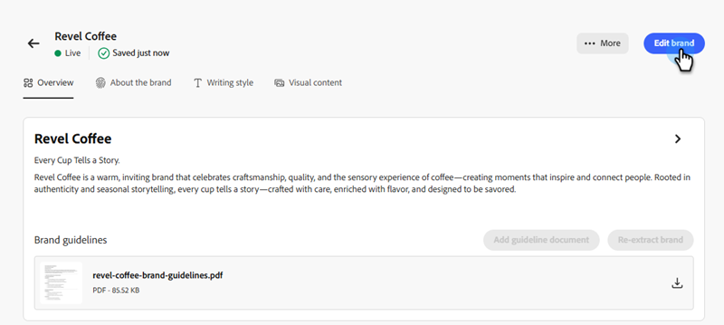

# Criar e gerenciar suas marcas {#create-and-manage-brands}

As diretrizes da marca são um conjunto detalhado de regras e padrões que estabelecem a identidade visual e verbal de uma marca. Eles atuam como uma referência para manter uma representação de marca consistente em todas as plataformas de marketing e comunicação.

Insira e organize manualmente os detalhes da sua marca ou faça upload dos documentos de diretrizes da marca para extração automática de informações.

>[!AVAILABILITY]
>
>Você deve concordar com o [contrato de usuário](https://www.adobe.com/legal/licenses-terms/adobe-dx-gen-ai-user-guidelines.html){target="_blank"} antes de usar o Assistente de IA no Adobe Marketo Engage. Para obter mais informações, entre em contato com o gerente de conta da Adobe.

## Acessar marcas {#access}

Para acessar o menu **[!UICONTROL marcas]** em [!DNL Adobe Marketo Engage], os usuários precisam receber a permissão relevante.

+++  Saiba como atribuir permissões relacionadas à marca

### Usuários e funções {#users-and-roles}

1. Em _Admin_, selecione **Usuários e Funções**.

1. Selecione a função desejada.

1. Clique para expandir o menu do **Access Design Studio**.

1. Selecione **Acessar o Assistente de IA** e clique em **Salvar**.

+++

## Criar e gerenciar sua marca {#create-brand-kit}

Para criar e gerenciar a diretriz da marca, você pode inserir os detalhes por conta própria ou fazer upload do documento de diretrizes da marca para que as informações sejam extraídas automaticamente.

1. Em _Admin_, selecione **Nova Experiência**.

   

1. Ao lado de _Gerenciar suas Marcas_, clique em **Editar**.

   

1. Clique em **[!UICONTROL Criar marca]**.

1. Digite um **[!UICONTROL Nome]** para sua marca.

1. Arraste e solte ou selecione seu PDF para fazer upload das diretrizes da sua marca e extrair automaticamente as informações relevantes sobre a marca. Clique em **[!UICONTROL Criar]**.

   O processo de extração de informações é iniciado. Pode levar vários minutos para ser concluído.

   

1. Seus padrões de criação de conteúdo e visual agora são preenchidos automaticamente. Navegue pelas diferentes guias para adaptar as informações conforme necessário.

1. No menu avançado de cada seção ou categoria, você pode adicionar referências para extrair automaticamente informações relevantes sobre a marca.

   Para remover conteúdo existente, use as opções **[!UICONTROL Limpar seção]** ou **[!UICONTROL Limpar categoria]**.

   {width="800" zoomable="yes"}

   {width="800" zoomable="yes"}

1. Clique em **Filtrar** para filtrar as diretrizes por canal ou tipo de elemento.

   

1. Quando terminar a configuração, clique em **[!UICONTROL Salvar]** e depois em **[!UICONTROL Publicar]** para disponibilizar sua diretriz de marca no Assistente de IA.

1. Para fazer modificações na sua marca publicada, clique em **[!UICONTROL Editar marca]**.

   >[!NOTE]
   >
   >Isso cria uma cópia temporária no modo de edição, substituindo a versão ativa após sua publicação.

   

1. No painel **[!UICONTROL Marcas]**, abra o menu avançado clicando no ícone de três pontos para:

* Exibir marca
* Editar
* Duplicar
* Publicação
* Desfazer publicação
* Excluir

  

As diretrizes de marca agora podem ser acessadas no menu suspenso **[!UICONTROL Marca]** do menu Assistente de IA, permitindo que ela gere conteúdo e ativos alinhados às suas especificações.

### Definir uma marca padrão {#default-brand}

Você pode designar uma marca publicada como padrão para ser aplicada automaticamente ao gerar conteúdo e calcular pontuações de alinhamento durante a criação da campanha.

Para definir uma marca padrão, vá para o painel **[!UICONTROL Marcas]**. Abra o menu avançado clicando no ícone de três pontos e selecionando **[!UICONTROL Marca como padrão]**.

