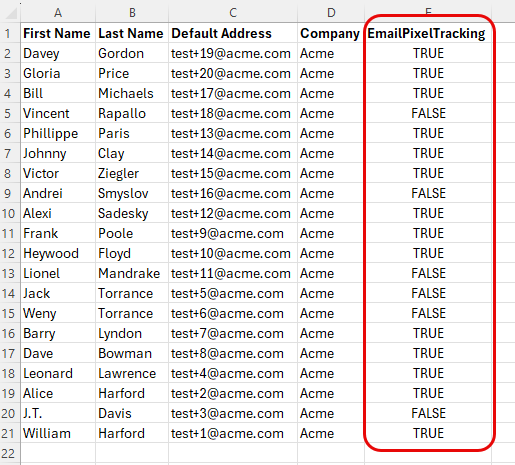

# Conformidade com a orientação da CNIL: rastreamento aberto de email condicional {#cnil}

Saiba como configurar o Marketo Engage para honrar o consentimento do usuário final para o rastreamento de abertura de email (pixel), em alinhamento com as diretrizes da CNIL (LINK DA COMUNIDADE). A abordagem usa um campo booleano personalizado para determinar qual variante de email uma pessoa recebe, uma com rastreamento aberto ativado ou outra com ele desativado.

## Etapa 1: criar um campo booleano personalizado {#custom-field}

1. Na área **Administrador**, clique em **Gerenciamento de Campos** e selecione **Novo Campo Personalizado**.

   

1. Para _Objeto_, escolha **Pessoa**. Para _Type_, escolha **Boolean**. Para _Name_, digite &quot;Rastreamento de pixels de email&quot; (o Nome da API é preenchido automaticamente). Clique em **Criar**.

   

## Etapa 2: Preencher o campo de consentimento {#populate}

1. Defina o valor do campo Acompanhamento de pixels de email para cada pessoa por meio da importação de dados (sincronização de API ou [upload de CSV](https://experienceleague.adobe.com/en/docs/marketo/using/getting-started/quick-wins/import-a-list-of-people){target="_blank"}).

   

1. Verifique se o campo personalizado está mapeado corretamente.

   

>[!NOTE]
>
>A partir de agora, é possível capturar os dados diretamente durante um preenchimento de formulário, permitindo que a pessoa aceite ou exclua o rastreamento de abertura de email.

## Etapa 3: Criar variantes de email {#variants}

Crie dois emails. Observe que o rastreamento de aberturas de email é ativado por padrão para o Designer de email e o editor de email herdado.

* **Email Um (rastreamento de abertura habilitado)**: depois de criar o email, nenhuma ação adicional é necessária. Mantenha o rastreamento aberto ativado.

* **Email Dois (rastreamento de abertura desabilitado)**: Clonar Email Um e desabilitar o rastreamento de abertura.

  

No Designer Email, a caixa de seleção **Desabilitar rastreamento aberto** pode ser encontrada na guia _Detalhes_ do painel _Resumo_ à direita do seu email. No editor de email herdado, a caixa de seleção **Desabilitar rastreamento aberto** pode ser encontrada no menu _Configurações de email_.

**Designer de email**

{width="800" zoomable="yes"}

**Editor de email herdado**

{width="800" zoomable="yes"}

## Etapa 4: configurar a Campanha inteligente {#smart-campaign}

[Crie uma Campanha Inteligente](https://experienceleague.adobe.com/en/docs/marketo/using/product-docs/core-marketo-concepts/smart-campaigns/creating-a-smart-campaign/create-a-new-smart-campaign){target="_blank"} para determinar qual email cada pessoa recebe.

1. Na guia _Fluxo_ da Campanha Inteligente, insira a etapa de fluxo **Enviar Email**.

   {width="800" zoomable="yes"}

1. Na etapa do fluxo, clique em **Adicionar opção**. Na Opção 1, defina **if** como _Acompanhamento de Pixel de Email_, defina o operador como _is_ e defina o valor como _false_. Para **Email**, selecione _Email Dois_.

1. Na Opção Padrão, defina o **Email** como _Email One_.

   

Isso garante que as pessoas que não consentiram em abrir o rastreamento recebam o email não rastreado, enquanto as pessoas que consentiram recebem o email rastreado padrão.
