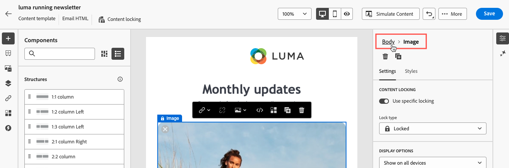
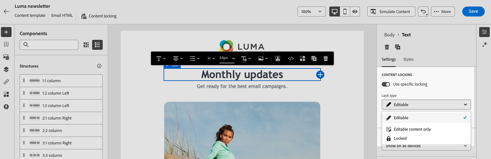

# Bloquear conteúdo em modelos de email {#lock-content-email-templates}

O Marketo Engage permite bloquear o conteúdo em modelos de email, bloqueando todo o modelo ou estruturas/componentes específicos. Isso permite evitar edições ou exclusões não intencionais, dando a você maior controle sobre a personalização do modelo e melhorando a eficiência e a confiabilidade de suas campanhas de email.

>[!AVAILABILITY]
>
>Os usuários com permissões para criar modelos de conteúdo podem ativar o bloqueio de conteúdo.

O bloqueio de conteúdo pode ser aplicado no nível **estrutura** ou no nível **componente**.

* Quando uma estrutura está bloqueada:

   * Todo o conteúdo dentro dessa estrutura também está bloqueado.
   * Nenhum conteúdo pode ser adicionado à estrutura.
   * Por padrão, não é possível excluir a estrutura. É possível substituir essa restrição ativando a opção &quot;Permitir exclusão&quot;.
   * Componentes de conteúdo individuais dentro da estrutura bloqueada podem ser definidos como editáveis.

* Quando uma estrutura é editável (estrutura não bloqueada):

   * Os componentes de conteúdo individuais podem ser bloqueados dentro dessa estrutura.
   * Por padrão, não é possível excluir um componente se ele estiver bloqueado ou se a opção &quot;Somente bloqueio de conteúdo editável&quot; estiver selecionada. É possível substituir essa restrição ativando a opção &quot;Permitir exclusão&quot;.

## Bloquear um modelo de email {#lock-an-email-template}

### Habilitar bloqueio de conteúdo {#enable-content-locking}

Você pode ativar o bloqueio de conteúdo para um modelo de email diretamente no Designer de email, independentemente de você estar criando um novo modelo ou editando um existente.

1. Abra ou crie um modelo de email e acesse a tela de edição de conteúdo no Designer de email.

1. No painel **[!UICONTROL Corpo]** à direita, habilite a opção **[!UICONTROL Governança]**.

1. Na lista suspensa **[!UICONTROL Modo]**, selecione o modo de bloqueio desejado para o modelo:

   * **[!UICONTROL Bloqueio de conteúdo]**: bloquear seções específicas de conteúdo no modelo. Por padrão, todas as estruturas e componentes se tornam editáveis. Em seguida, você pode bloquear seletivamente elementos individuais.
   * **[!UICONTROL Somente leitura]**: bloqueia todo o conteúdo do modelo, impedindo modificações.

   {width="800" zoomable="yes"}

1. Se você selecionou o modo **[!UICONTROL Bloqueio de conteúdo]**, poderá definir ainda mais como os usuários podem interagir com o modelo. Habilite a opção **[!UICONTROL Habilitar edição de conteúdo]** e escolha uma das seguintes opções:

   * **[!UICONTROL Permitir adição de estrutura e conteúdo]**: os usuários podem adicionar estruturas entre as existentes e adicionar componentes ou fragmentos de conteúdo em estruturas editáveis.

   * **[!UICONTROL Permitir somente adição de conteúdo]**: os usuários podem adicionar componentes ou fragmentos de conteúdo dentro de estruturas editáveis, mas não podem adicionar ou duplicar estruturas.

1. Após selecionar o modo de bloqueio, é possível definir quais estruturas e/ou componentes serão bloqueados se você tiver selecionado o modo **[!UICONTROL Bloqueio de conteúdo]**:

   * [Saiba como bloquear estruturas](#lock-structures)
   * [Saiba como bloquear componentes](#lock-components)

   Se você escolher o modo **[!UICONTROL Somente leitura]**, poderá prosseguir com a finalização e o salvamento do modelo.

Você pode ajustar as configurações de **[!UICONTROL Governança]** a qualquer momento ao criar o modelo selecionando o corpo do modelo. Para fazer isso, clique no link **[!UICONTROL Corpo]** no painel de navegação localizado na parte superior do painel do lado direito.

{width="800" zoomable="yes"}

### Bloquear estruturas {#lock-structures}

Para bloquear uma estrutura no modelo:

1. Selecione a estrutura que deseja bloquear.

1. Na lista suspensa **[!UICONTROL Tipo de bloqueio]**, escolha **[!UICONTROL Bloqueado]**.

   {width="800" zoomable="yes"}

   >[!NOTE]
   >
   >Por padrão, os usuários não podem excluir estruturas bloqueadas. Você pode anular essa restrição habilitando a opção **[!UICONTROL Permitir exclusão]**.

Depois de bloquear uma estrutura, nenhum componente ou fragmento de conteúdo adicional pode ser duplicado ou adicionado dentro dela. Todos os componentes em uma estrutura bloqueada também são bloqueados por padrão. Para tornar um componente editável em uma estrutura bloqueada:

1. Selecione o componente que deseja desbloquear.

1. Habilitar a opção **[!UICONTROL Usar bloqueio específico]**.

1. Na lista suspensa **[!UICONTROL Tipo de bloqueio]**, escolha **[!UICONTROL Editável]**. Para permitir a edição de conteúdo ao bloquear estilos, selecione **[!UICONTROL Somente conteúdo editável]**. [Saiba como bloquear componentes](#lock-components)

   {width="800" zoomable="yes"}

### Bloquear componentes {#lock-components}

Para bloquear um componente específico em uma estrutura:

1. Selecione o componente e habilite a opção **[!UICONTROL Usar bloqueio específico]** no painel direito.

1. Na lista suspensa **[!UICONTROL Tipo de bloqueio]**, selecione sua opção de bloqueio preferencial:

   {width="800" zoomable="yes"}

   * **[!UICONTROL Bloqueio de conteúdo editável somente]**: bloqueia os estilos do componente, mas permite a edição de conteúdo.
   * **[!UICONTROL Bloqueado]**: bloqueia totalmente o conteúdo e os estilos do componente.

   >[!NOTE]
   >
   >O tipo de bloqueio **[!UICONTROL Editável]** permite que os usuários editem um componente, mesmo dentro de uma estrutura bloqueada. [Saiba como bloquear estruturas](#lock-structures)

1. Por padrão, os usuários não podem excluir componentes bloqueados. Você pode habilitar a exclusão ativando a opção **[!UICONTROL Permitir exclusão]**.

### Identificar conteúdo bloqueado {#identify-locked-content}

Para identificar facilmente as estruturas e os componentes bloqueados no modelo, use a **[!UICONTROL Árvore de navegação]**, localizada no menu do lado esquerdo. Esse menu fornece uma visão geral visual de todos os elementos do modelo, destacando itens bloqueados com um ícone de bloqueio e itens editáveis com um ícone de lápis.

No exemplo abaixo, a governança é ativada para o corpo do template. A *Estrutura 2* está bloqueada com o *Componente 1* editável, enquanto a *Estrutura 3* está totalmente bloqueada.

{width="800" zoomable="yes"}

## Usar modelos com conteúdo bloqueado {#use-templates-with-locked-content}

Ao usar um modelo com conteúdo bloqueado, a mensagem **[!UICONTROL Governança habilitada]** é exibida no painel direito.

Dependendo do tipo de bloqueio aplicado ao modelo, você pode executar ações diferentes nas estruturas e nos componentes do modelo. Para identificar rapidamente todas as áreas editáveis no modelo, habilite a opção **[!UICONTROL Realçar áreas editáveis]**.

Por exemplo, no modelo abaixo, todas as áreas são editáveis, exceto a imagem superior que foi bloqueada, o que significa que não é possível editá-la ou removê-la.

{width="800" zoomable="yes"}

Estes são alguns exemplos de edição de emails e a configuração de bloqueio de conteúdo associada que foi definida:

<table>
<thead>
  <tr>
    <th>Tipo de bloqueio de conteúdo</th>
    <th>Configuração do modelo</th>
    <th>Edição de email</th>
  </tr></thead>
<tbody>
  <tr>
    <td>Modelo de conteúdo somente leitura</td>
    <td></td>
    <td></td>
  </tr>
  <tr>
    <td>O conteúdo completo é editável, mas os usuários não podem adicionar nenhuma estrutura ou componente</td>
    <td></td>
    <td></td>
  </tr>
  <tr>
    <td>Estrutura bloqueada que não pode ser excluída</td>
    <td></td>
    <td></td>
  </tr>
  <tr>
    <td>Componente com estilos bloqueados e que não pode ser excluído. Os usuários só podem modificar o conteúdo.</td>
    <td></td>
    <td></td>
  </tr>
  <tr>
    <td>Componente editável em uma estrutura bloqueada.</td>
    <td></td>
    <td></td>
  </tr>
</tbody>
</table>
