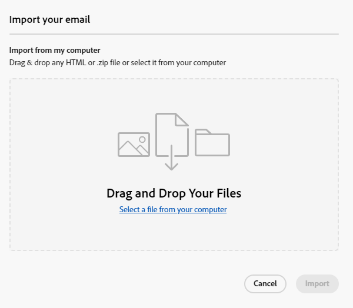

# Criação de email {#email-authoring}

Saiba como criar, personalizar e visualizar emails no novo Marketo Engage Email Designer.

>[!PREREQUISITES]
>
>Para acessar o novo designer de email, sua assinatura do Marketo Engage deve ser migrada para o [Adobe Identity Management System (IMS)](https://experienceleague.adobe.com/pt-br/docs/marketo/using/product-docs/administration/marketo-with-adobe-identity/adobe-identity-management-overview){target="_blank"}. Se a sua ainda não tiver sido lançada e você quiser solicitá-la, contate a Equipe de Conta da Adobe (seu gerente de conta) ou o [Suporte da Marketo](https://nation.marketo.com/t5/support/ct-p/Support){target="_blank"}.

## Criar um email {#create-an-email}

Emails do designer de email só podem ser criados no Design Studio e referenciados em Campanhas/Listas inteligentes, ou criados/usados diretamente em Programas de email no momento.

>[!BEGINTABS]

>[!TAB Design Studio]

1. Faça logon no Marketo Engage por meio da [Adobe Experience Cloud](https://experiencecloud.adobe.com/){target="_blank"}.

1. Em Meu Marketo, selecione **Design Studio**.

   

1. Na árvore, selecione **Emails (Novos)**.

   

1. Clique no botão **Criar email**.

   

1. Insira um nome de email e uma linha de assunto. Clique em **Criar**.

   

>[!TAB Programa de email]

1. Faça logon no Marketo Engage por meio da [Adobe Experience Cloud](https://experiencecloud.adobe.com/){target="_blank"}.

1. Localize e selecione (ou crie) seu programa de email.

   

1. Você tem duas opções para criar um novo email. Clique com o botão direito do mouse no nome do seu Programa de email e selecione **Novo ativo local** ou clique no botão **+Novo email** na caixa Email no painel. Neste exemplo, faremos o primeiro.

   

1. Selecione **Email (Novo Editor)**.

   

1. Insira um nome de email e uma linha de assunto. Clique em **Criar**.

   

>[!ENDTABS]

Pronto. Agora é hora de projetar seu email.

## Escolha seu tipo de conteúdo {#choose-your-content-type}

1. No email que acabou de criar, clique em **Editar conteúdo de email**.

   

1. A página _Criar seu email_ é carregada. Você pode escolher entre algumas opções:

* [Criar do zero](#design-from-scratch) usando o editor visual de email

* [Importar seu próprio HTML](#import-html) por meio de um arquivo HTML ou zip

* [Selecione um modelo existente](#choose-a-template) (uma de nossas amostras ou uma que você já salvou)

### Criar do zero {#design-from-scratch}

Ao começar do zero no editor de email, use as opções abaixo para definir seu conteúdo.

1. Na página _Criar seu email_, selecione **Design do zero**.

1. Escolha entre começar com um tema (recomendado) ou criar do zero com estilo manual.

   >[!NOTE]
   >
   >Os emails criados com estilo manual não poderão usar fragmentos criados com temas

1. Adicione [estrutura e conteúdo](#add-structure-and-content) ao seu email.

1. Adicionar [imagens](#add-assets).

1. [Personalize](#personalize-content) seu conteúdo.

1. Examine os links e [edite o rastreamento](#edit-url-tracking).

### Importar HTML {#import-html}

Você pode importar conteúdo existente do HTML para criar seu email. O conteúdo pode ser:

* Um arquivo HTML com uma folha de estilos incorporada

* Um arquivo .zip que inclui um arquivo HTML, a folha de estilos (.css) e as imagens

>[!NOTE]
>
>Não há restrições na estrutura do arquivo .zip. No entanto, as referências devem ser relativas e se encaixar na estrutura de árvore da pasta .zip.

1. Na página Criar seu modelo, selecione **Importar HTML**.

1. Arraste e solte o arquivo HTML ou .zip desejado (ou selecione um arquivo no computador) e clique em **Importar**.

   

>[!NOTE]
>
>Quando o conteúdo do HTML for carregado, o conteúdo estará no modo Compatibilidade. Nesse modo, você só pode personalizar seu texto, adicionar links ou adicionar ativos ao seu conteúdo.

Você pode fazer as alterações desejadas no conteúdo importado usando as [ferramentas do editor visual de email](#add-structure-and-content).

### Escolher um modelo {#choose-a-template}

Há dois tipos de modelos para escolher.

* **Modelos de exemplo**: o Marketo Engage oferece quatro modelos de email predefinidos.

* **Modelos salvos**: são modelos criados do zero usando o menu Modelos ou um email que você criou e optou por salvar como modelo.

>[!BEGINTABS]

>[!TAB Modelos de exemplo]

Escolha um dos modelos prontos para uso para um head start no design do modelo de email.

1. A guia Modelos de amostra é aberta por padrão.

1. Selecione o template que deseja usar.

   

1. Clique em **Usar este modelo**.

   

1. Edite o conteúdo conforme desejado usando o designer de conteúdo visual.

>[!TAB Modelos salvos]

1. Clique na guia **Modelos salvos** e selecione o modelo desejado.

   

1. Clique em **Usar este modelo**.

   

1. Edite o conteúdo conforme desejado usando o designer de conteúdo visual.

>[!ENDTABS]

## Adicionar estrutura e conteúdo {#add-structure-and-content}

1. Para começar a criar ou modificar conteúdo, arraste e solte um item de Estruturas na tela. Edite suas configurações no painel à direita.

   >[!TIP]
   >
   >Selecione o componente de coluna n:n para definir o número de colunas de sua escolha (entre três e 10). Você também pode definir a largura de cada coluna movendo as setas abaixo dela.

   

   >[!NOTE]
   >
   >Cada tamanho de coluna não pode ser menor que 10% da largura total do componente de estrutura. Somente colunas vazias podem ser removidas.

1. Na seção Conteúdo, arraste sobre os itens desejados e solte-os em um ou mais componentes da estrutura.

   

1. Cada componente pode ser personalizado por meio das guias Configurações ou Estilo. Altere a fonte, o estilo do texto, a margem e muito mais.

### Adicionar fragmentos {#add-fragments}

1. Para acessar os fragmentos, selecione o ícone _Fragmentos_ (  ) na navegação à esquerda.

   {width="700" zoomable="yes"}

1. Arraste e solte qualquer um dos fragmentos no espaço reservado do componente estrutural.

O editor renderiza o fragmento na seção/elemento da estrutura de email. O conteúdo do fragmento é atualizado dinamicamente na estrutura para mostrar como o conteúdo aparece no email.

>[!TIP]
>
>Se quiser que o fragmento ocupe todo o layout horizontal no email, adicione uma estrutura de coluna 1:1 e arraste e solte o fragmento nele.

Depois que o email for salvo, ele aparecerá na guia _[!UICONTROL Usado por]_ da página de detalhes do fragmento. Os fragmentos adicionados a um modelo de email não são editáveis no modelo; o fragmento de origem define o conteúdo.

### Adicionar o Assets {#add-assets}

Adicione imagens armazenadas na seção [Imagens e Arquivos](/help/marketo/product-docs/demand-generation/images-and-files/add-images-and-files-to-marketo.md){target="_blank"} da instância do Marketo Engage.

>[!NOTE]
>
>Você só pode adicionar imagens no novo designer, sem outros tipos de arquivo no momento.

1. Para acessar suas imagens, clique no ícone Seletor de ativos.

   

1. Arraste e solte a imagem desejada em um componente de estrutura.

   

   >[!NOTE]
   >
   >Para substituir uma imagem existente, selecione-a e clique em **Selecionar um ativo** na guia Configurações à direita.

### Camadas, configurações e estilos {#layers-settings-styles}

Abra a árvore de navegação para acessar estruturas específicas e suas colunas/componentes para uma edição mais granular. Para acessar o, clique no ícone da Árvore de navegação.

O exemplo abaixo descreve as etapas para ajustar o preenchimento e o alinhamento vertical dentro de um componente de estrutura composto por colunas.

1. Selecione a coluna no componente de estrutura diretamente na tela ou usando a _Árvore de navegação_ exibida à esquerda.

1. Na barra de ferramentas da coluna, clique na ferramenta _[!UICONTROL Selecionar uma coluna]_ e escolha a que deseja editar.

   Também é possível selecioná-la na árvore de estrutura. Os parâmetros editáveis para essa coluna são exibidos nas guias _[!UICONTROL Configurações]_ e _[!UICONTROL Estilos]_ à direita.

   

1. Para editar as propriedades da coluna, clique na guia _[!UICONTROL Estilos]_ à direita e altere-os de acordo com suas necessidades:

   * Para **[!UICONTROL Plano de fundo]**, altere a cor do plano de fundo conforme necessário.

     Desmarque a caixa de seleção para um plano de fundo transparente. Habilite a configuração **[!UICONTROL Imagem de plano de fundo]** para usar uma imagem como plano de fundo em vez de uma cor sólida.

   * Para o **[!UICONTROL Alinhamento]**, selecione o ícone _Superior_, _Meio_ ou _Inferior_.
   * Para **[!UICONTROL Preenchimento]**, defina o preenchimento para todos os lados.

     Selecione **[!UICONTROL Preenchimento diferente para cada lado]** se desejar ajustar o preenchimento. Clique no ícone _Bloquear_ para interromper a sincronização.

   * Expanda a seção **[!UICONTROL Avançado]** para definir estilos embutidos para a coluna.

   

1. Repita essas etapas conforme necessário para ajustar o alinhamento e o preenchimento das outras colunas no componente.

1. Salve as alterações.

### Personalizar conteúdo {#personalize-content}

Os tokens funcionam no novo editor da mesma forma que no antigo, mas o ícone é diferente. O exemplo abaixo descreve a adição de um token de nome com texto de fallback.

1. Selecione o componente de texto. Coloque o cursor onde deseja que o token apareça e clique no ícone **Adicionar personalização**.

   

1. Clique no [tipo de token](/help/marketo/product-docs/demand-generation/landing-pages/personalizing-landing-pages/tokens-overview.md){target="_blank"} desejado.

   

1. Encontre o token desejado e clique no ícone **...** (se você clicar no ícone +, será adicionado um token sem texto de fallback).

   

   >[!NOTE]
   >
   >&quot;Texto de fallback&quot; é o novo termo do editor para o valor padrão. Exemplo: ``{{lead.First Name:default=Friend}}``. É recomendado caso não haja valor para a pessoa no campo escolhido.

1. Defina o texto de fallback e clique em **Adicionar**.

   

1. Clique em **Salvar**.

### Editar rastreamento de URL {#edit-url-tracking}

Às vezes, você não quer ativar o URL de rastreamento do Marketo em um link em um email. Isso é útil quando a página de destino não suporta parâmetros de URL e pode resultar em um link quebrado.

1. Clique no ícone Links para exibir todos os URLs do email.

   

1. Clique no ícone de lápis para editar o rastreamento dos links desejados.

1. Clique no menu suspenso **Tipo de rastreamento** e faça sua seleção.

   

   <table><tbody>
     <tr>
       <td><b>Rastrear sem mkt_tok</b></td>
       <td>Ativa o rastreamento no URL sem usar o parâmetro de sequência de consulta mkt_tok no URL de destino</td>
     </tr>
     <tr>
       <td><b>Rastrear com mkt_tok</b></td>
       <td>Ativa o rastreamento no URL com o uso do parâmetro de sequência de consulta mkt_tok no URL de destino</td>
     </tr>
     <tr>
       <td><b>Não rastrear</b></td>
       <td>Desativa o rastreamento do URL</td>
     </tr>
   </tbody>
   </table>

1. Como opção, você pode dar um rótulo ao URL ou adicionar tags.

1. Clique em **Salvar** quando terminar.

## Verificar alertas {#check-alerts}

À medida que você cria seu conteúdo, os alertas são exibidos no canto superior direito da tela quando as configurações principais estão ausentes.

Há dois tipos de alertas:

**Avisos**

Os avisos se referem às recomendações e práticas recomendadas, como:

* **O link para opção de não participação não está presente no corpo do email**: embora os links para cancelamento de inscrição sejam um requisito, a prática recomendada é adicioná-los ao corpo do email.

>[!NOTE]
>
>Não é necessário adicionar uma opção de cancelamento de inscrição para [Emails Operacionais](/help/marketo/product-docs/email-marketing/general/functions-in-the-editor/make-an-email-operational.md) (não marketing).

* **A versão de texto do HTML está vazia**: você deve definir uma versão de texto do corpo do email para quando o conteúdo do HTML não puder ser exibido.

* **Um link vazio está presente no corpo do email**: verifique se todos os links no seu email estão corretos.

* **O tamanho do email excedeu o limite de 100 KB**: para uma entrega ideal, verifique se o tamanho do seu email não excede 100 KB.

**Erros**

Os erros impedem que você envie ou teste o email até que sejam resolvidos:

* **Linha de assunto ausente**: é necessária uma linha de assunto de email.

* **A versão do email da mensagem está vazia**: esse erro ocorre quando o conteúdo do email não foi configurado.

## Testar seu email {#test-your-email}

Quando o conteúdo da mensagem é definido, você pode usar perfis de teste para pré-visualizá-la, enviar provas e controlar a forma como ela é renderizada em clientes populares de desktop, dispositivos móveis e baseados na Web. Se você inseriu conteúdo personalizado, é possível verificar como ele é exibido na mensagem usando os dados do perfil de teste.

Para visualizar seu conteúdo de email, clique em **Simular conteúdo** e adicione um perfil de teste para verificar sua mensagem usando os dados do perfil de teste.

## Referenciar um email {#reference-an-email}

Os emails do Designer de email podem ser acessados em Programas de email, Engajamento, Padrão e Evento (com a única exceção dos Programas de webinário interativos). Se você criou seu email no Design Studio, ele pode ser referenciado a partir de Campanhas inteligentes e/ou Smart Lists, como você faria com qualquer outro email.

* Faça referência a ele em uma Smart List [seguindo as etapas habituais](/help/marketo/product-docs/core-marketo-concepts/smart-lists-and-static-lists/creating-a-smart-list/create-a-smart-list.md).

* Referencie-o em uma Campanha Inteligente por [seguindo as etapas habituais](/help/marketo/product-docs/core-marketo-concepts/smart-campaigns/creating-a-smart-campaign/create-a-new-smart-campaign.md).

>[!NOTE]
>
>Somente os emails salvos podem ser referenciados. Não há status de &quot;aprovado&quot; no novo designer de email.

>[!MORELIKETHIS]
>
>[Modelos de email](/help/marketo/product-docs/email-marketing/email-designer/email-template-authoring.md){target="_blank"}: saiba como criar, projetar e acessar um modelo de email no novo designer.
