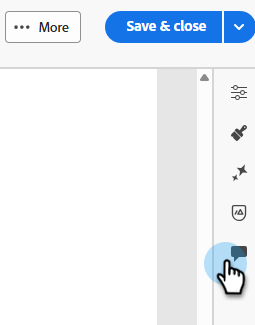
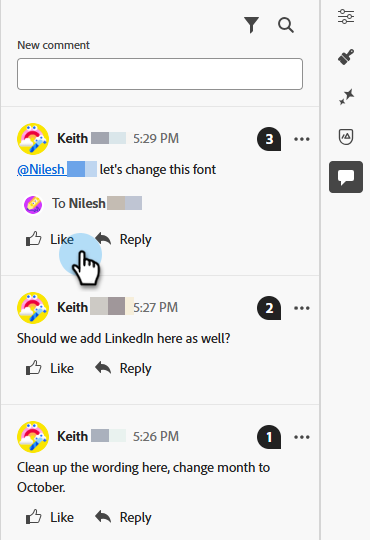

# Colaboração de email {#email-collaboration}

A colaboração e os comentários por email permitem que as equipes de marketing revisem, discutam e finalizem ativos de email no Adobe Marketo Engage Email Designer. Em vez de compartilhar rascunhos por meio de ferramentas externas (como bate-papo, threads de email, planilhas etc.), você pode comentar, sugerir edições e resolver comentários em tempo real. Isso simplifica o fluxo de trabalho, reduz erros e garante que as partes interessadas sejam alinhadas antes que uma campanha de email seja enviada.

## Permissões {#permissions}

Os usuários que têm permissões de edição para um ativo de email poderão comentar, marcar e exibir comentários. Usuários com permissões somente leitura para ativos de email **não** poderão adicionar ou exibir comentários.

## Adicionar comentários {#add-comments}

1. Ao criar ou editar um email no Designer de email, clique em uma estrutura, coluna ou conteúdo (texto, imagem, botão etc.) em qualquer seção editável.

   

1. Clique no ícone de comentário.

   

1. Insira comentários, perguntas ou sugestões.

   

>[!NOTE]
>
>Adicione tags a colegas de equipe usando @mentions (por exemplo, &quot;@John, please update the Winter Newsletter&quot;).

## Exibir todos os comentários {#view-all-comments}

1. Clique no ícone _Collaboration_ no lado direito.

   

1. Responda rapidamente ou curta um comentário.

   

1. Clique no ícone **...** para obter mais ações.

   

## Resolver comentários {#resolve-comments}

Cada thread de comentários inclui:

* Responder: Continuar a discussão
* Resolver: marcar o comentário como resolvido
* Não resolver: se mais edições forem necessárias
* Remover: remove o comentário do elemento de design
* Excluir: exclui permanentemente o comentário

>[!NOTE]
>
>As threads resolvidas são ocultas por padrão, mas podem ser revisitadas selecionando a thread desejada no filtro.

## Notificações {#notifications}

Os membros da equipe marcados recebem notificações por email e/ou por pulso.

As notificações são acionadas para:

* Novos comentários
* Menções (@username)
* Resoluções

## Práticas recomendadas {#best-practices}

* Use @mentions para garantir que o feedback chegue rapidamente ao membro certo da equipe.

* Agrupe o feedback relacionado em uma única thread de comentário em vez de várias notas dispersas.

* Sempre resolva os comentários depois de endereçados para manter um fluxo de trabalho limpo.

* Salvar uma versão final aprovada para fins de conformidade/auditoria.
