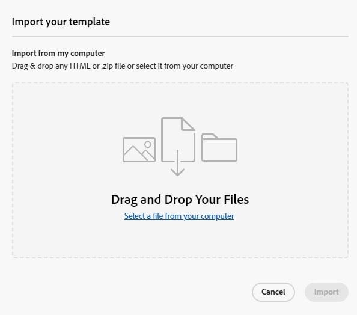

# Criação de modelo de email {#email-template-authoring}

Para um processo de design acelerado e aprimorado, é possível criar modelos de email independentes para reutilizar facilmente o conteúdo personalizado.

>[!PREREQUISITES]
>
>Para acessar o novo designer de email, sua assinatura do Marketo Engage deve ser migrada para o [Adobe Identity Management System (IMS)](https://experienceleague.adobe.com/pt-br/docs/marketo/using/product-docs/administration/marketo-with-adobe-identity/adobe-identity-management-overview). Se a sua ainda não tiver sido lançada e você quiser solicitá-la, contate a Equipe de Conta da Adobe (seu gerente de conta) ou o [Suporte da Marketo](https://nation.marketo.com/t5/support/ct-p/Support).

>[!NOTE]
>
>Os modelos de email no novo designer de email só podem ser usados para criar emails no novo designer de email. Eles não podem ser referenciados no editor de email antigo.

## Criar um modelo de email {#create-an-email-template}

1. Faça logon no Marketo Engage por meio da [Adobe Experience Cloud](https://experiencecloud.adobe.com/){target="_blank"}.

1. Em Meu Marketo, selecione **Design Studio**.

   

1. Na árvore, selecione **Modelos de email (Novo editor)**.

   

1. Clique no botão **Criar modelo**.

   

1. Insira um nome de template e uma descrição opcional. Clique em **Criar**.

   

## Criar seu modelo {#design-your-template}

Na página _Criar seu modelo_, você pode escolher entre algumas opções. [Criar do zero](#design-from-scratch), [importar seu próprio HTML](#import-html) ou [selecionar um modelo existente](#choose-a-template) (uma de nossas amostras ou uma que você já salvou).

### Criar do zero {#design-from-scratch}

Defina o conteúdo adicionando e movendo elementos estruturais com ações simples de arrastar e soltar.

1. Na página _Criar seu modelo_, selecione **Criar do zero**.

1. Adicionar [estrutura e conteúdo](#add-structure-and-content).

### Importar seu HTML {#import-your-html}

Você pode importar conteúdo existente do HTML para criar seus modelos de email. O conteúdo pode ser:

* Um arquivo HTML com uma folha de estilos incorporada

* Um arquivo .zip que inclui um arquivo HTML, a folha de estilos (.css) e as imagens

>[!NOTE]
>
>Não há restrições na estrutura do arquivo .zip. No entanto, as referências devem ser relativas e se encaixar na estrutura de árvore da pasta .zip.

1. Na página _Criar seu modelo_, selecione **Importar HTML**.

1. Arraste e solte o arquivo HTML ou .zip desejado (ou selecione um arquivo no computador) e clique em **Importar**.

   

   >[!NOTE]
   >
   >Quando o conteúdo do HTML for carregado, o conteúdo estará no modo Compatibilidade. Nesse modo, você só pode personalizar seu texto, adicionar links ou adicionar ativos ao seu conteúdo.

1. Para aproveitar os componentes de conteúdo do Email Designer, clique na guia **Conversor de HTML** e em **Converter**.

   >[!CAUTION]
   >
   >Usar uma marca `<table>` como a primeira camada em um arquivo do HTML pode causar perda de estilo, incluindo configurações de plano de fundo e largura na marca de camada superior.

Agora você pode personalizar o arquivo importado, conforme necessário, com o editor visual de email.

### Escolher um modelo {#choose-a-template}

Há dois tipos de modelos para escolher.

* **Modelos de exemplo**: o Marketo Engage oferece quatro modelos de email predefinidos.

* **Modelos salvos**: são modelos criados do zero usando o menu Modelos ou um email que você criou e optou por salvar como modelo.

>[!BEGINTABS]

>[!TAB Modelos de exemplo]

Escolha um dos modelos prontos para uso para um head start no design do modelo de email.

1. A guia Modelos de amostra é aberta por padrão.

1. Selecione o template que deseja usar.

   

1. Clique em **Usar este modelo**.

   

1. Edite o conteúdo conforme desejado usando o designer de conteúdo visual.

>[!TAB Modelos salvos]

1. Clique na guia **Modelos salvos** e selecione o modelo desejado.

   

1. Clique em **Usar este modelo**.

   

1. Edite o conteúdo conforme desejado usando o designer de conteúdo visual.

>[!ENDTABS]

## Adicionar estrutura e conteúdo {#add-structure-and-content}

1. Para começar a criar ou modificar conteúdo, arraste e solte um item de Estruturas na tela. Edite suas configurações no painel à direita.

   >[!TIP]
   >
   >Selecione o componente de coluna n:n para definir o número de colunas de sua escolha (entre três e 10). Você também pode definir a largura de cada coluna movendo as setas abaixo dela.

   

   >[!NOTE]
   >
   >Cada tamanho de coluna não pode ser menor que 10% da largura total do componente de estrutura. Somente colunas vazias podem ser removidas.

1. Na seção Conteúdo, arraste sobre os itens desejados e solte-os em um ou mais componentes da estrutura.

   

1. Cada componente pode ser personalizado por meio das guias Configurações ou Estilo. Altere a fonte, o estilo do texto, a margem e muito mais.

### Adicionar fragmentos {#add-fragments}

1. Para acessar os fragmentos, selecione o ícone _Fragmentos_ (  ) na navegação à esquerda.

   {width="700" zoomable="yes"}

1. Arraste e solte qualquer um dos fragmentos no espaço reservado do componente estrutural.

O editor renderiza o fragmento na seção/elemento da estrutura de email. O conteúdo do fragmento é atualizado dinamicamente na estrutura para mostrar como o conteúdo aparece no email.

>[!TIP]
>
>Se quiser que o fragmento ocupe todo o layout horizontal no email, adicione uma estrutura de coluna 1:1 e arraste e solte o fragmento nele.

Depois que o email for salvo, ele aparecerá na guia _[!UICONTROL Usado por]_ da página de detalhes do fragmento. Os fragmentos adicionados a um modelo de email não são editáveis no modelo; o fragmento de origem define o conteúdo.

### Adicionar ativos {#add-assets}

Adicione imagens armazenadas na seção [Imagens e Arquivos](/help/marketo/product-docs/demand-generation/images-and-files/add-images-and-files-to-marketo.md){target="_blank"} da instância do Marketo Engage.

>[!NOTE]
>
>Você só pode adicionar imagens no novo designer, sem outros tipos de arquivo no momento.

1. Para acessar suas imagens, clique no ícone Seletor de ativos.

   

1. Arraste e solte a imagem desejada em um componente de estrutura.

   

   >[!NOTE]
   >
   >Para substituir uma imagem existente, selecione-a e clique em **Selecionar um ativo** na guia Configurações à direita.

### Camadas, configurações e estilos {#layers-settings-styles}

Abra a árvore de navegação para acessar estruturas específicas e suas colunas/componentes para uma edição mais granular. Para acessar o, clique no ícone da Árvore de navegação.

O exemplo abaixo descreve as etapas para ajustar o preenchimento e o alinhamento vertical dentro de um componente de estrutura composto por colunas.

1. Selecione a coluna no componente de estrutura diretamente na tela ou usando a _Árvore de navegação_ exibida à esquerda.

1. Na barra de ferramentas da coluna, clique na ferramenta _[!UICONTROL Selecionar uma coluna]_ e escolha a que deseja editar.

   Também é possível selecioná-la na árvore de estrutura. Os parâmetros editáveis para essa coluna são exibidos nas guias _[!UICONTROL Configurações]_ e _[!UICONTROL Estilos]_ à direita.

   

1. Para editar as propriedades da coluna, clique na guia _[!UICONTROL Estilos]_ à direita e altere-os de acordo com suas necessidades:

   * Para **[!UICONTROL Plano de fundo]**, altere a cor do plano de fundo conforme necessário.

     Desmarque a caixa de seleção para um plano de fundo transparente. Habilite a configuração **[!UICONTROL Imagem de plano de fundo]** para usar uma imagem como plano de fundo em vez de uma cor sólida.

   * Para o **[!UICONTROL Alinhamento]**, selecione o ícone _Superior_, _Meio_ ou _Inferior_.
   * Para **[!UICONTROL Preenchimento]**, defina o preenchimento para todos os lados.

     Selecione **[!UICONTROL Preenchimento diferente para cada lado]** se desejar ajustar o preenchimento. Clique no ícone _Bloquear_ para interromper a sincronização.

   * Expanda a seção **[!UICONTROL Avançado]** para definir estilos embutidos para a coluna.

   

1. Repita essas etapas conforme necessário para ajustar o alinhamento e o preenchimento das outras colunas no componente.

1. Salve as alterações.

### Personalizar conteúdo {#personalize-content}

Os tokens funcionam no novo editor da mesma forma que no antigo, mas o ícone é diferente. O exemplo abaixo descreve a adição de um token de nome com texto de fallback.

1. Selecione o componente de texto. Coloque o cursor onde deseja que o token apareça e clique no ícone **Adicionar personalização**.

   

1. Clique no [tipo de token](/help/marketo/product-docs/demand-generation/landing-pages/personalizing-landing-pages/tokens-overview.md){target="_blank"} desejado.

   

1. Encontre o token desejado e clique no ícone **...** (se você clicar no ícone +, será adicionado um token sem texto de fallback).

   

   >[!NOTE]
   >
   >&quot;Texto de fallback&quot; é o novo termo do editor para o valor padrão. Exemplo: ``{{lead.First Name:default=Friend}}``. É recomendado caso não haja valor para a pessoa no campo escolhido.

1. Defina o texto de fallback e clique em **Adicionar**.

   

1. Clique em **Salvar**.

### Editar rastreamento de URL {#edit-url-tracking}

Às vezes, você não quer ativar o URL de rastreamento do Marketo em um link em um email. Isso é útil quando a página de destino não suporta parâmetros de URL e pode resultar em um link quebrado.

1. Clique no ícone Links para exibir todos os URLs do email.

   

1. Clique no ícone de lápis para editar o rastreamento dos links desejados.

1. Clique no menu suspenso **Tipo de rastreamento** e faça sua seleção.

   

   <table><tbody>
     <tr>
       <td><b>Rastrear sem mkt_tok</b></td>
       <td>Ativa o rastreamento no URL sem usar o parâmetro de sequência de consulta mkt_tok no URL de destino</td>
     </tr>
     <tr>
       <td><b>Rastrear com mkt_tok</b></td>
       <td>Ativa o rastreamento no URL com o uso do parâmetro de sequência de consulta mkt_tok no URL de destino</td>
     </tr>
     <tr>
       <td><b>Não rastrear</b></td>
       <td>Desativa o rastreamento do URL</td>
     </tr>
   </tbody>
   </table>

1. Como opção, você pode dar um rótulo ao URL ou adicionar tags.

1. Clique em **Salvar** quando terminar.

### Exibir opções {#view-options}

Aproveite as opções de exibição e validação de conteúdo disponíveis no editor visual de email.

* Aumente/diminua o zoom do conteúdo usando as opções de zoom predefinidas.

* Visualizar o conteúdo na área de trabalho, dispositivo móvel ou somente texto/texto simples.

   * Clique no ícone de exibição em tempo real (olho) para pré-visualização de conteúdo em todos os dispositivos.

   * Selecione um dos dispositivos prontos para uso ou insira dimensões personalizadas para visualizar seu conteúdo.

### Mais opções {#more-options}

Nas opções **Mais** do editor de conteúdo, você pode realizar as seguintes ações:

* **Redefinir modelo**: selecione essa opção para limpar a tela do designer de email visual em branco e reiniciar a criação de conteúdo.

* **Alterar seu design**: volte para a página _Criar seu modelo_. Aqui, você pode executar qualquer ação descrita na seção [Criar seu modelo](#design-your-template).

* **Exportar HTML**: baixe o conteúdo na tela visual para o sistema local no formato HTML empacotado como um arquivo zip.

## Exibir detalhes do modelo {#view-template-details}

Na página de listagem _Modelos de email_, clique no nome de um modelo de email para exibir seus detalhes.

Detalhes básicos como nome e descrição podem ser editados. Clique fora do campo que você editou para salvar suas alterações.

Clique em **Mais** para excluir ou duplicar rapidamente seu modelo.

Se houver alertas ativos (erros/avisos para o modelo de email), clique em Alertas para exibir as informações.

>[!NOTE]
>
>Embora esses alertas não proíbam o uso do modelo de email para criação de email, as informações fornecem visibilidade sobre o que pode não funcionar e as atualizações necessárias antes que o email possa ser usado para a entrega.

## Exibir modelo de email usado por referências {#email-template-used-by-references}

No resumo do modelo de email, clique na guia **Usado por** para exibir detalhes sobre onde esse modelo de email foi usado no Marketo Engage.

## Editar modelos de email {#edit-email-templates}

Esta ação pode ser tomada a partir de:

* Na guia de detalhes - Clique em **Editar modelo de email**.

Esta ação direciona você à página _Criar modelo_ ou à página do editor de conteúdo visual com base no último status salvo do modelo de email. Aqui, você pode editar o conteúdo do seu modelo de email conforme necessário. Consulte Criar modelos de email para obter informações sobre as opções de edição.

## Modelos de email duplicados {#duplicate-email-templates}

Há duas maneiras de duplicar um template de email:

* Nos detalhes do modelo de email à direita, clique em **Mais** e selecione **Duplicar**.

  

* Na página de listagem _Modelos de email_, clique no ícone Mais ações (três pontos) do modelo de email desejado e escolha **Duplicar**.

Na caixa de diálogo, digite um nome exclusivo e uma descrição opcional. Clique em **Duplicar** quando terminar.

O modelo de email duplicado aparece na página de listagem _Modelos de email_.

## Excluir modelos de email {#delete-email-templates}

Há duas maneiras de excluir um template de email.

>[!CAUTION]
>
>A exclusão de um modelo de email não pode ser desfeita.

* Nos detalhes do modelo de email à direita, clique em **Mais** e selecione **Excluir**.

  

* Na página de listagem _Modelos de email_, clique no ícone Mais ações (três pontos) do modelo de email desejado e escolha **Excluir**.

## Ações em massa {#bulk-actions}

Na página de listagem _Modelos de email_, selecione vários modelos marcando as caixas de seleção à esquerda. Um banner é exibido na parte inferior.

**Excluir**: é possível excluir no máximo 20 modelos de cada vez. Uma caixa de diálogo de confirmação permite suspender a ação ou confirmar a exclusão.

>[!MORELIKETHIS]
>
>[Criação de email](/help/marketo/product-docs/email-marketing/email-designer/email-authoring.md){target="_blank"}: saiba como criar, projetar e fazer referência a um email no novo designer.
