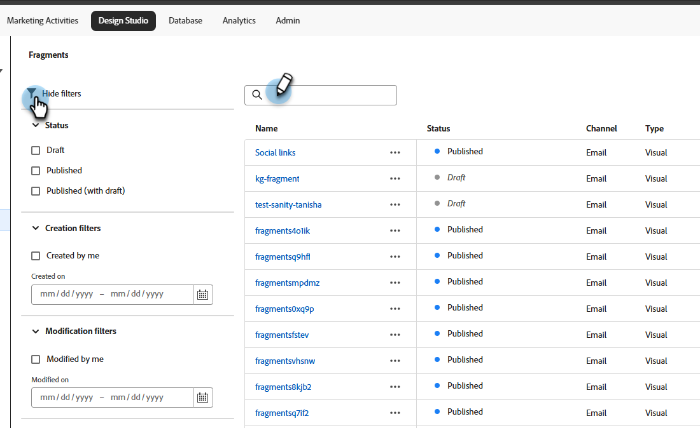
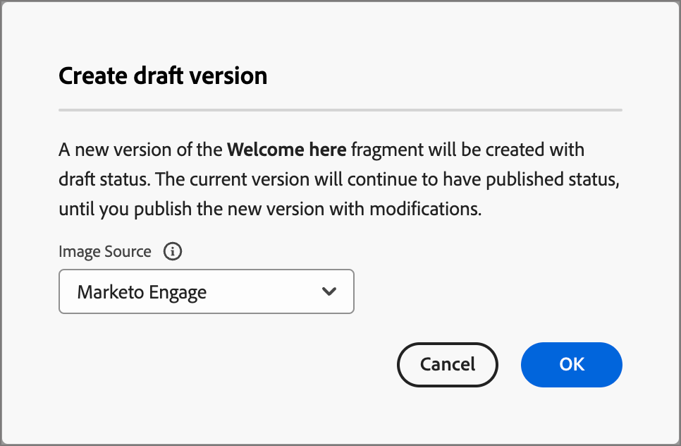

# Fragmentos

Um fragmento é um componente reutilizável que pode ser referenciado em um ou mais emails e modelos de email. Normalmente, é um bloco de conteúdo (texto, imagem ou ambos) que pode ser inserido rapidamente no projeto. Com essa funcionalidade, você pode pré-criar vários blocos de conteúdo personalizados para reunir conteúdo de email e obter um processo de design aprimorado. Casos de uso comuns incluem blocos de conteúdo de cabeçalho/rodapé para email, banners de convite para eventos, mensagens sazonais e muito mais.

Para aproveitar ao máximo os fragmentos em seus workflows:

* _Criar fragmentos_ - Crie fragmentos visuais, do zero ou salvando o conteúdo como um fragmento do editor de conteúdo visual.
* _Reutilizar fragmentos_ - Use-os quantas vezes forem necessárias em seu conteúdo.

## Fragmentos visuais {#visual-fragments}

Fragmentos visuais são blocos visuais predefinidos criados (usando o editor de conteúdo visual) que podem ser reutilizados em vários emails ou modelos de email.

## Acessar e gerenciar fragmentos {#access-and-manage-fragments}

Para acessar fragmentos visuais, acesse o **Design Studio** no Marketo Engage. Na árvore à esquerda, clique em **[!UICONTROL Fragmentos (Novo)]**.

{width="600" zoomable="yes"}

Por padrão, a tabela é classificada pela coluna _[!UICONTROL Modificado]_. Clique em outros títulos de coluna para alterar a classificação da tabela. Clique no mesmo título novamente para alternar entre crescente e decrescente.

### Localizar e filtrar

Use a barra de pesquisa para localizar um fragmento por nome. Clique no ícone _Filtro_ (  ) para mostrar as opções de filtro disponíveis e escolher as configurações desejadas.

{width="700" zoomable="yes"}

### Personalizar as colunas {#customize-the-column-display}

Personalize as colunas que deseja exibir na tabela clicando no ícone _Personalizar tabela_ (  ) na parte superior direita.

Selecione as colunas desejadas e clique em **[!UICONTROL Aplicar]**.

{width="400" zoomable="yes"}

### Status do fragmento {#fragment-status}

O status do fragmento determina sua disponibilidade para uso em um email ou modelo de email e as alterações que você pode fazer nele.

<table>
<tbody>
  <tr>
    <td width="25%"><b>Rascunho</b></td>
    <td width="75%">Quando você cria um fragmento, ele está no status de rascunho. Ele permanece como rascunho até que você o publique para uso em um modelo de email ou.
    
Ações disponíveis:
    <li>Editar todos os detalhes</li>
    <li>Editar no designer visual</li>
    <li>Publicar</li>
    <li>Duplicar</li>
    <li>Excluir</li>
  </td>
  <tr>
    <td><b>Publicado</b></td>
    <td>Ao publicar um fragmento, ele fica disponível para uso em um email ou template de email. O conteúdo do fragmento publicado não pode ser modificado no designer visual.
    
Ações disponíveis:
    <li>Edite a descrição</li>
    <li>Adicionar a um email ou modelo</li>
    <li>Criar versão de rascunho</li>
    <li>Duplicar</li>
    <li>Excluir (se não estiver em uso)</li>
    </td>
  </tr>
  <tr>
    <td style="width:25%"><b>Publicado com rascunho</b></td>
    <td style="width:75%">Ao criar um rascunho de um fragmento publicado, a versão publicada permanece disponível para uso em um modelo de email ou de email e o conteúdo do rascunho pode ser modificado no designer visual. Se você publicar a versão de rascunho, ela substituirá a versão publicada atual e o conteúdo será atualizado em <i>todos</i> os emails e modelos de email nos quais está sendo usada. 
    
Ações disponíveis:
    <li>Edite a descrição</li>
    <li>Adicionar a um email ou modelo</li>
    <li>Editar versão de rascunho no visual designer</li>
    <li>Publicar versão de rascunho</li>
    <li>Duplicar</li>
    <li>Excluir (se não estiver em uso)</li>
    </td>
  </tr>
</tbody>
</table>

## Criar fragmentos {#create-fragments}

1. Para criar um novo fragmento visual, clique em **[!UICONTROL Criar fragmento]** na parte superior direita da página da lista de fragmentos.

   {width="700" zoomable="yes"}

1. Dê um **[!UICONTROL Nome]** ao fragmento e uma **[!UICONTROL Descrição]** opcional.

   _Requisitos de fragmento_

   * Nome: máx. de 100 caracteres; deve ser exclusivo, sem distinção entre maiúsculas e minúsculas
   * Descrição: máximo de 300 caracteres
   * Caracteres: caracteres alfanuméricos, numéricos e especiais estão OK
   * Os caracteres reservados **_não são permitidos_**: `\ / : * ? " < > |`

   {width="400" zoomable="yes"}

1. Clique em **[!UICONTROL Criar]**.

   {width="400" zoomable="yes"}

   >[!NOTE]
   >
   >O **Tipo** de um fragmento não pode ser modificado no momento.

   O designer visual é aberto com uma tela vazia.

1. Use as [ferramentas de design de conteúdo](/help/marketo/product-docs/email-marketing/email-designer/email-authoring.md#add-structure-and-content){target="_blank"} para criar o conteúdo do fragmento visual.

1. Clique em **[!UICONTROL Salvar]** a qualquer momento para salvar o fragmento de rascunho.

1. Quando estiver pronto para disponibilizar o fragmento para uso em um modelo de email ou email, clique em **[!UICONTROL Publicar]**.

## Exibir detalhes do fragmento {#view-fragment-details}

Clique no nome de qualquer fragmento na página da lista para abrir a página de detalhes do fragmento. Você pode optar por editar o fragmento, renomeá-lo ou atualizar sua descrição. Faça atualizações e clique fora do campo de nome ou descrição para salvar as alterações.

>[!NOTE]
>
>Se um fragmento publicado estiver sendo usado por um modelo de email ou de email, você não poderá alterar seu nome ou editar o conteúdo. Você pode criar uma versão de rascunho se quiser fazer alterações no fragmento.

{width="600" zoomable="yes"}

Clique em **[!UICONTROL Editar fragmento]** para abrir o fragmento no editor de conteúdo visual.

Saia da exibição a qualquer momento clicando na seta _Voltar_ na parte superior esquerda, que o retorna à página da lista _Fragmentos_.

## Exibir fragmento usado por referências {#view-fragment-used-by-references}

Na página de detalhes do fragmento, clique na guia **[!UICONTROL Usado por]** para exibir detalhes sobre onde o fragmento está sendo usado no Marketo Engage.

>[!IMPORTANT]
>
>Um fragmento que está sendo usado atualmente por um modelo de email ou de email não pode ser excluído.

{width="600" zoomable="yes"}

Clique no link para abrir o email ou modelo de email correspondente onde o fragmento é usado.

## Excluir fragmentos {#delete-fragments}

Como um fragmento que está sendo usado atualmente por um modelo de email ou de email não pode ser excluído, verifique as referências _usado por_ antes de iniciar a remoção de um fragmento. Além disso, uma remoção não pode ser desfeita, portanto, verifique antes de iniciar uma ação de exclusão.

É possível excluir um fragmento usando um dos seguintes métodos:

* Nos detalhes do fragmento à direita, clique em **[!UICONTROL Excluir]**.
* Na página de listagem _[!UICONTROL Fragmentos]_, clique nas reticências ao lado do fragmento e escolha **[!UICONTROL Excluir]**.

Essa ação abre uma caixa de diálogo de confirmação. Você pode anular o processo clicando em **[!UICONTROL Cancelar]** ou em **[!UICONTROL Excluir]** para confirmar a exclusão.

{width="400"}

## Editar fragmentos {#edit-fragments}

As edições em um fragmento dependem do status atual:

* Quando um fragmento está no status _Rascunho_, é possível editar qualquer um de seus detalhes e o conteúdo visual.
* Quando um fragmento está no status _Publicado_, é possível editar a descrição do fragmento, mas não o nome. Não é possível editar o conteúdo visual.
* Quando um fragmento está no status _Publicado com rascunho_, a edição de detalhes fica limitada à descrição. Também é possível editar o conteúdo visual da versão de rascunho.

>[!BEGINTABS]

>[!TAB Rascunho]

1. Na página de listagem _[!UICONTROL Fragmentos]_, clique no nome do fragmento para abri-lo.

   Uma visualização do conteúdo visual é exibida, com os detalhes do fragmento à direita.

1. Faça as edições desejadas.

   {width="600" zoomable="yes"}

1. Para fazer alterações no conteúdo no designer visual, clique em **[!UICONTROL Editar fragmento]**. Clique em **Salvar** quando terminar.

1. Clique em **[!UICONTROL Salvar]** ou **[!UICONTROL Salvar e fechar]** para retornar aos detalhes do fragmento.

1. Quando quiser disponibilizar o fragmento para uso em um email ou modelo de email, clique em **[!UICONTROL Publicar]**.

>[!TAB Publicado]

1. Na página de listagem _[!UICONTROL Fragmentos]_, clique no nome do fragmento para abri-lo.

   Uma visualização do conteúdo visual é exibida, com os detalhes do fragmento à direita.

1. Modifique a descrição, se necessário.

   Para um fragmento publicado, todos os outros detalhes não podem ser alterados.

1. Para atualizar o conteúdo, clique em **[!UICONTROL Criar versão de rascunho]** na parte superior direita.

   Clique em **[!UICONTROL OK]** na caixa de diálogo para abrir a versão de rascunho no designer visual. Você pode alterar o `image source` KG - LINK AQUI, se necessário.

   {width="300"}

1. Clique em **[!UICONTROL Salvar]** ou **[!UICONTROL Salvar e fechar]** para retornar aos detalhes do fragmento.

1. Quando quiser disponibilizar o fragmento para uso em um email ou modelo de email, clique em **[!UICONTROL Publicar]**.

>[!NOTE]
>
>Ao publicar a versão de rascunho, ela substitui a versão publicada atual e o conteúdo é atualizado nos emails e templates de email em que já está em uso.

>[!TAB Publicado com rascunho]

Há duas maneiras de abrir a versão de rascunho para edição na página de listagem _[!UICONTROL Fragmentos]_:

* Clique no ícone _Mais_ (**...**) ao lado do nome do fragmento e escolha **[!UICONTROL Abrir versão de rascunho]**.

  {width="300"}

* Clique no nome do fragmento para abri-lo. Em seguida, clique em **[!UICONTROL Abrir versão de rascunho]** na parte superior direita.

Uma visualização do conteúdo visual da versão de rascunho é exibida, com os detalhes do fragmento à direita.

Para atualizar o conteúdo:

1. Clique em **[!UICONTROL Editar fragmento]** na parte superior direita. Clique em **Salvar** quando terminar.

1. Clique em **[!UICONTROL Salvar]** ou **[!UICONTROL Salvar e fechar]** para retornar aos detalhes do fragmento.

1. Quando quiser disponibilizar o fragmento para uso em um email ou modelo de email, clique em **[!UICONTROL Publicar]**.

>[!NOTE]
>
>Ao publicar a versão de rascunho, ela substitui a versão publicada atual e o conteúdo é atualizado nos emails e templates de email em que já está em uso.

>[!ENDTABS]

## Duplicar fragmentos {#duplicate-fragments}

É possível duplicar um fragmento usando um dos seguintes métodos:

* Na página de listagem _[!UICONTROL Fragmentos]_, clique no ícone _Mais_ (**...**) ao lado do nome do fragmento e escolha **[!UICONTROL Duplicar]**.
* Na parte superior direita da página de detalhes do fragmento, clique em **[!UICONTROL ... Mais]** e escolha **[!UICONTROL Duplicar]**.

{width="600" zoomable="yes"}

Na caixa de diálogo, digite um nome exclusivo e uma descrição opcional. Clique em **[!UICONTROL Duplicar]**.

{width="400"}

O fragmento duplicado aparece na listagem _Fragmentos_.

## Salvar um novo fragmento do conteúdo do email ou do modelo {#save-a-new-fragment-from-email-or-template-content}

Ao criar/editar um modelo de email ou de email no editor de conteúdo visual, você pode salvar todo o conteúdo ou parte dele como um fragmento para reutilização.

1. Para salvar o conteúdo como um fragmento, clique em **[!UICONTROL Mais]** e escolha **[!UICONTROL Salvar como fragmento]**.

1. Selecione os diferentes elementos a serem incluídos no fragmento.

   Selecione várias estruturas mantendo pressionado o botão Shift ou Control.

   Você só pode selecionar estruturas adjacentes entre si.

1. Com o conteúdo selecionado, clique em **[!UICONTROL Criar]** na parte superior direita.

1. Na caixa de diálogo, insira um nome e uma descrição opcional para o fragmento e clique em **[!UICONTROL Criar]**.

O fragmento é exibido na página de listagem _Fragmentos_ e está disponível para uso em emails e modelos de email.

## Adicionar fragmentos visuais ao conteúdo do email ou modelo {#add-visual-fragments-to-your-email-or-template-content}

Os fragmentos foram projetados para reutilização. Você pode adicionar até 30 em um email ou modelo de email e eles podem ser aninhados somente até um nível.

* [Adicionar um fragmento a um email](/help/marketo/product-docs/email-marketing/email-designer/email-authoring.md#add-fragments)

* [Adicionar um fragmento a um modelo de email](/help/marketo/product-docs/email-marketing/email-designer/email-template-authoring.md#add-fragments)

O conteúdo do fragmento é atualizado dinamicamente na estrutura para renderizar um visual de como o conteúdo aparece no email.

>[!TIP]
>
>Se quiser que o fragmento ocupe todo o layout horizontal no email, adicione uma estrutura de coluna [!UICONTROL 1:1] e arraste e solte o fragmento nele.

Depois que o modelo de email/email for salvo, ele aparecerá na página de detalhes do fragmento quando a guia _[!UICONTROL Usado por]_ for selecionada. Os fragmentos adicionados não podem ser editados no email ou modelo — o fragmento de origem publicado define o conteúdo.

## Fragmentar as ações durante o email e a criação do modelo {#fragment-actions-during-email-and-template-authoring}

Quando um fragmento é adicionado a um email ou modelo de email, seu conteúdo não pode ser editado no email ou modelo. No entanto, você pode aplicar as seguintes ações:

* **[!UICONTROL Excluir]** - Remove o fragmento do conteúdo atual do email ou do modelo de email (a origem do fragmento não é afetada).
* **[!UICONTROL Atualizar]** - atualiza o conteúdo do fragmento no email ou modelo de email atual. Atualizar é útil quando você deseja refletir qualquer edição recente no fragmento após a adição ao email ou modelo de email.
* **[!UICONTROL Duplicar]** - Duplica o fragmento no mesmo email ou modelo de email no editor. O fragmento duplicado é adicionado logo abaixo do original.
* **[!UICONTROL Abrir fragmento]** - abre uma nova guia do navegador com a página e os detalhes do editor de fragmento.
* **[!UICONTROL Interromper herança]** - Interrompe a herança do fragmento (e suas alterações) da origem. Use esta ação para disponibilizar o conteúdo do fragmento como conteúdo independente e editável no modelo de email ou de email. Esta ação também remove o email ou o modelo de email da referência _Usado por_ do fragmento original.

Quando você seleciona o fragmento na página do editor, essas ações estão disponíveis na barra de ferramentas de contexto e no painel de propriedades à direita.

{width="600" zoomable="yes"}
