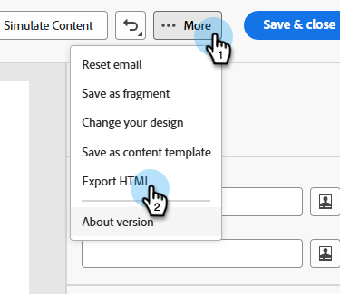
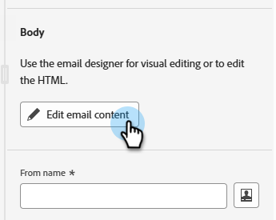

# Integração do GenStudio para o Marketo Engage {#genstudio-integration-for-marketo-engage}

O Adobe GenStudio for Performance Marketing é um aplicativo generativo de IA que permite criar seus próprios anúncios e emails para impulsionar campanhas de marketing impactantes e personalizadas que atendam aos padrões da sua marca e às políticas da sua empresa. Ele oferece várias ferramentas que simplificam as complexidades da criação de conteúdo.

>[!INFO]
>
>Saiba mais sobre o [GenStudio for Performance Marketing](https://experienceleague.adobe.com/pt-br/docs/genstudio-for-performance-marketing/user-guide/home){target="_blank"}.

## Aproveitar os recursos do GenStudio no Marketo Engage {#leverage-genstudio-capabilities}

Com essa integração, um profissional de marketing técnico que usa o Marketo Engage para desenvolver e automatizar campanhas de email pode colaborar com um profissional de marketing de desempenho que cria conteúdo usando o GenStudio. Isso permite integrar facilmente o conteúdo da marca do GenStudio ao Marketo Engage.

## Exportar um modelo do HTML do Marketo Engage para o GenStudio {#export-an-html-template}

Exporte facilmente um modelo, incluindo as diretrizes da sua marca, para a GenStudio for Performance Marketing.

1. No Marketo Engage, acesse o conteúdo do seu email.

1. No Designer Email, clique no botão **Mais** e selecione **Exportar HTML**.

   

1. [Carregar o modelo exportado do HTML](https://experienceleague.adobe.com/en/docs/genstudio-for-performance-marketing/user-guide/content/templates/use-templates#templates-from-ajo-and-marketo){target="_blank"} para o GenStudio for Performance Marketing.

1. No GenStudio, use este modelo para [criar várias variações de email](https://experienceleague.adobe.com/en/docs/genstudio-for-performance-marketing/user-guide/create/create-email-experience){target="_blank"} com prompts de IA e salvá-las.

## Aproveitar as experiências do GenStudio no Marketo Engage {#leverage-genstudio-experiences}

Para aproveitar as variações de email do GenStudio que você criou importando-as para o Marketo Engage, siga as etapas abaixo.

1. No Marketo Engage, [crie um email](/help/marketo/product-docs/email-marketing/email-designer/email-authoring.md#create-an-email).

1. Na página Detalhes do email, clique em **Editar conteúdo do email**.

   

1. Selecione **Importar HTML**.

   

1. Clique no botão **Adobe GenStudio for Performance Marketing**.

   

1. Navegue pelas experiências do GenStudio para começar a criar o conteúdo. Você pode filtrar as experiências em critérios como produtos, personas, marcas ou até mesmo cores.

1. Selecione uma experiência e clique em **Usar**.

   {width="800" zoomable="yes"}

1. O conteúdo selecionado é exibido no Designer de email.

   {width="800" zoomable="yes"}

>[!NOTE]
>
>As experiências do GenStudio criadas a partir de um modelo do Marketo Engage são importadas diretamente para o Designer de email. As experiências do GenStudio criadas sem um modelo do Marketo Engage são importadas no modo de compatibilidade.

Use as [ferramentas de edição de conteúdo de email](/help/marketo/product-docs/email-marketing/email-designer/email-authoring.md#add-structure-and-content){target="_blank"} e os [campos de personalização](/help/marketo/product-docs/email-marketing/email-designer/email-authoring.md#personalize-content){target="_blank"} para editar seu email conforme desejado.
