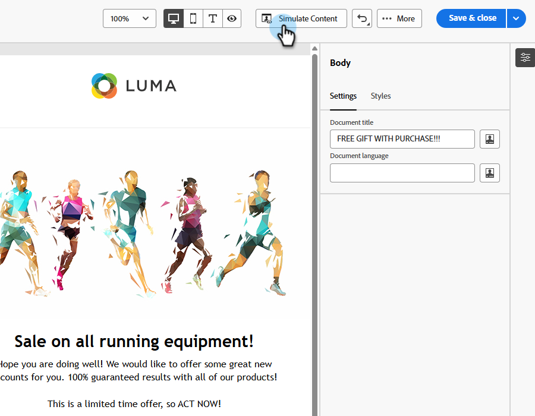

# Relatório de spam de email {#email-spam-report}

Usando o SpamAssassin no Marketo Engage, você pode testar seu conteúdo de e-mail e ver a probabilidade de ISPs/provedores de caixa de correio marcá-lo como spam.

O SpamAssassin analisa seu conteúdo e atribui uma pontuação com base em vários critérios. Quanto menor a pontuação, melhor. É importante manter uma pontuação baixa, pois o envio de emails com uma pontuação alta pode afetar negativamente a capacidade geral de entrega.

## Acessar o relatório de spam {#access-the-spam-report}

1. No seu email, clique em **Simular Conteúdo**.

   {width="600" zoomable="yes"}

   >[!NOTE]
   >
   >Se você ainda não tiver adicionado um perfil de teste, precisará fazer isso logo após a Etapa 1.

1. Clique no botão **Relatório de spam**.

   

1. Um relatório de spam é gerado.

   {width="600" zoomable="yes"}

1. Verifique as pontuações e descrições de cada item.

   >[!IMPORTANT]
   >
   >Se a pontuação geral for superior a 5, seu email poderá ser bloqueado pelo recipient ou marcado como spam no momento do delivery.

1. Se você considerar a pontuação muito alta, edite seu conteúdo no Designer de Email com base nas descobertas do relatório e execute novamente o **Relatório de spam**.

   {width="800" zoomable="yes"}

Quando a pontuação for do seu agrado, ela estará pronta para ser enviada.

{width="800" zoomable="yes"}

>[!NOTE]
>
>A pontuação de spam é derivada do SpamAssassin e as **regras não são de propriedade da Adobe**. Mais detalhes sobre essas regras podem ser encontrados na [documentação do SpamAssassin](https://spamassassin.apache.org/#_blank){target="_blank"}. Uma lista completa de erros [pode ser vista aqui](https://spamassassin.apache.org/old/tests_3_0_x.html){target="_blank"}.
