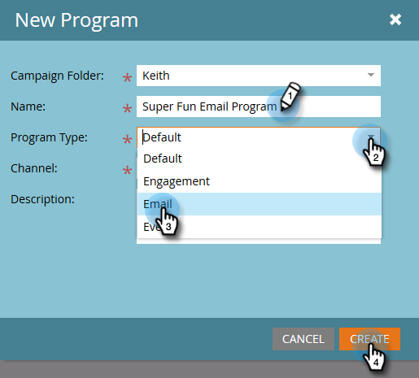

# Criar um programa de email {#create-an-email-program}

Use programas de email para enviar um email de maneira rápida e fácil para um grupo de pessoas.

1. Vá para **[!UICONTROL Atividades de marketing]**.

   

1. Selecione a pasta na qual deseja criar o programa, clique no menu suspenso **[!UICONTROL Novo]** e selecione **[!UICONTROL Novo programa]**.

   

1. Insira um Nome, selecione **[!UICONTROL Email]** como o [!UICONTROL Tipo de Programa] e clique em **[!UICONTROL Criar]**.

   

   >[!NOTE]
   >
   >Ao selecionar **[!UICONTROL Email]** como Tipo de Programa, o Canal será automaticamente definido como **[!UICONTROL Envio de Email]**. Você pode alterá-lo se quiser.

   

Legal! Observe que o programa agora está na árvore e pronto para ser usado. A próxima etapa será definir o público-alvo. Consulte os Artigos relacionados ao Marketo abaixo.

>[!MORELIKETHIS]
>
>* [Definir um público-alvo com uma lista inteligente](/help/marketo/product-docs/email-marketing/email-programs/managing-people-in-email-programs/define-an-audience-with-a-smart-list.md)
>* [Definir um público-alvo importando uma lista](/help/marketo/product-docs/email-marketing/email-programs/managing-people-in-email-programs/define-an-audience-by-importing-a-list.md)
