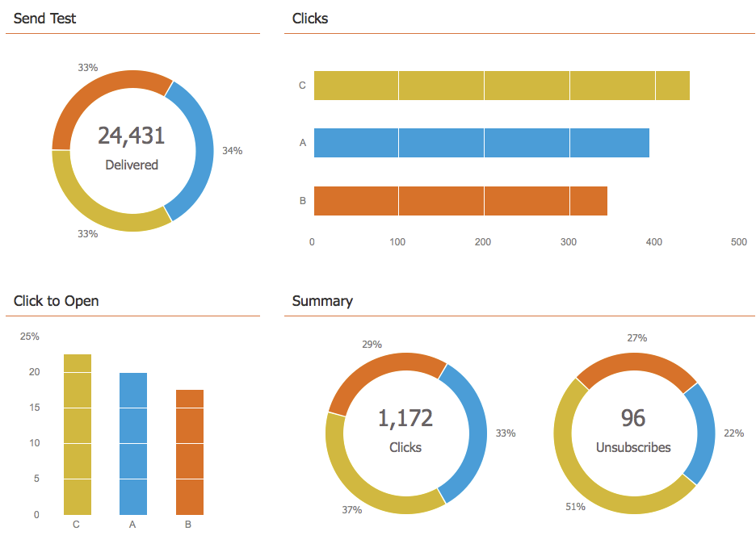
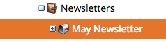

# Noções básicas sobre programas de email {#understanding-email-programs}

Envie emails, crie testes A/B e rastreie os resultados em um só lugar.

## Painel de controle {#control-panel}

Quatro caixas mantêm você concentrado. **Público** define &quot;quem&quot;, **E-mail** fornece o &quot;quê&quot;, **Agendar** define &quot;quando&quot; e **Aprovação** O torna pronto para ser usado.

## Teste A/B {#a-b-testing}

O teste A/B permite provar qual email é o melhor.

Saiba mais sobre os seguintes testes A/B:

* [Teste A/B &quot;Linha de assunto&quot;](/help/marketo/product-docs/email-marketing/email-programs/email-program-actions/email-test-a-b-test/use-subject-line-a-b-testing.md)
* [Teste A/B &quot;Email inteiro&quot;](/help/marketo/product-docs/email-marketing/email-programs/email-program-actions/email-test-a-b-test/use-whole-email-a-b-testing.md)
* [Teste A/B &quot;Do endereço&quot;](/help/marketo/product-docs/email-marketing/email-programs/email-program-actions/email-test-a-b-test/use-from-address-a-b-testing.md)
* [Teste A/B &quot;Data/Hora&quot;](/help/marketo/product-docs/email-marketing/email-programs/email-program-actions/email-test-a-b-test/use-date-time-a-b-testing.md)

## Painéis {#dashboards}

>[!TIP]
>
>Alguns preferem usar programas de e-mail ao envio de um e-mail por meio de uma campanha inteligente, devido ao painel de relatórios detalhado do programa.

Aproveite os frutos do seu trabalho. Os painéis mostram rapidamente o desempenho do programa de email e do teste A/B.

## Aninhamento {#nesting}

Os programas de email funcionam bem com outros programas.

Use um programa de email para enviar um convite de webinário, por exemplo.

Use um programa de email dentro de um programa padrão para manter as coisas organizadas.

>[!TIP]
>
>Para colocar um programa de e-mail existente em outro programa, você precisa cloná-lo.

>[!NOTE]
>
>Programas de email não podem ser aninhados em [programas de envolvimento](/help/marketo/getting-started/quick-wins/drip-drip-nurture.md). Eles também não podem ser reenviados e só podem executar um teste de cada vez.

## Configurações de programação {#schedule-settings}

Agora que você entende Programas de email, comece a usar um dos artigos relacionados abaixo.

>[!MORELIKETHIS]
>
>* [Criar um programa de email](/help/marketo/product-docs/email-marketing/email-programs/creating-an-email-program/create-an-email-program.md)
>
>* [Definir um público-alvo com uma lista inteligente](/help/marketo/product-docs/email-marketing/email-programs/managing-people-in-email-programs/define-an-audience-with-a-smart-list.md)
>* [Criar um email para um programa de email](/help/marketo/product-docs/email-marketing/email-programs/email-program-actions/create-an-email-for-an-email-program.md)
>* [Agendar seu programa de email](/help/marketo/product-docs/email-marketing/email-programs/email-program-actions/schedule-your-email-program.md)
