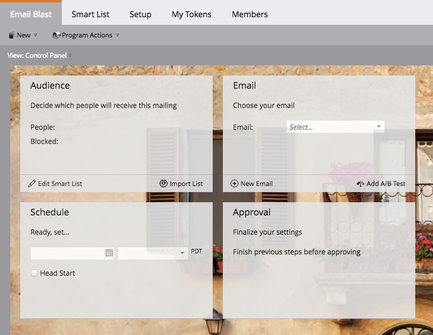

# Noções básicas sobre Programas de email {#understanding-email-programs}

Diga olá para seu novo amigo Marketo, o programa de e-mail. Envie emails, crie testes A/B e rastreie seus resultados em um único lugar.

## Painel de controle do Campaign {#control-panel}

Quatro caixas mantêm você focado. **O** Audience define o &quot;quem&quot;, o  **** e-mail fornece o &quot;o quê&quot;, o  **** Agendamento define &quot;quando&quot; e o  **** Aprovaltorna pronto para ser aceito.

## Teste A/B {#a-b-testing}

O teste A/B permite que você prove qual email é melhor.

Saiba mais sobre os seguintes testes A/B:

* [Teste A/B da &quot;Linha do assunto&quot;](/help/marketo/product-docs/email-marketing/email-programs/email-program-actions/email-test-a-b-test/use-subject-line-a-b-testing.md)
* [Teste A/B &quot;Email Inteiro&quot;](/help/marketo/product-docs/email-marketing/email-programs/email-program-actions/email-test-a-b-test/use-whole-email-a-b-testing.md)
* [Teste A/B &quot;De Endereço&quot;](/help/marketo/product-docs/email-marketing/email-programs/email-program-actions/email-test-a-b-test/use-from-address-a-b-testing.md)
* [Teste A/B &quot;Data/Hora&quot;](/help/marketo/product-docs/email-marketing/email-programs/email-program-actions/email-test-a-b-test/use-date-time-a-b-testing.md)

## Painéis {#dashboards}

>[!TIP]
>
>Alguns preferem usar programas de e-mail em vez de enviar um e-mail por uma campanha inteligente devido ao painel detalhado do relatórios do programa.

Aproveite os frutos do seu trabalho. Os painéis mostram rapidamente o desempenho do programa de e-mail e do teste A/B.

## Aninhamento {#nesting}

Programas de e-mail são bem tocados com outros programas.

Use um programa de email para enviar um convite de webinar, por exemplo.

Use um programa de email dentro de um programa padrão para manter as coisas organizadas.

>[!TIP]
>
>Para obter um programa de email existente em outro programa, é necessário cloná-lo.

>[!NOTE]
>
>Programas de email não podem ser aninhados em [programas de envolvimento](/help/marketo/getting-started/quick-wins/drip-drip-nurture.md). Eles também não podem ser reenviados e só podem executar um teste de cada vez.

## Configurações de agendamento {#schedule-settings}

Agora que você entende Programas por email, comece com um dos artigos relacionados abaixo!

>[!MORELIKETHIS]
>
>* [Criar um Programa por email](/help/marketo/product-docs/email-marketing/email-programs/creating-an-email-program/create-an-email-program.md)
   >
   >
* [Definir uma Audiência com uma Lista inteligente](/help/marketo/product-docs/email-marketing/email-programs/managing-people-in-email-programs/define-an-audience-with-a-smart-list.md)
>* [Criar um email para um Programa de email](/help/marketo/product-docs/email-marketing/email-programs/email-program-actions/create-an-email-for-an-email-program.md)
>* [Agendar seu Programa de email](/help/marketo/product-docs/email-marketing/email-programs/email-program-actions/schedule-your-email-program.md)

